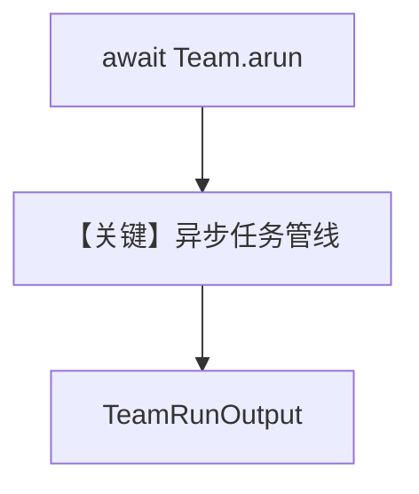

# 07_async_task_mode.py — 实现原理分析

<!-- cookbook-py-source:start -->
## 完整源码

```python
"""
Async Task Mode Example

Demonstrates task mode using the async API (arun / aprint_response).
Useful for applications that need non-blocking execution, such as web servers.

Run: .venvs/demo/bin/python cookbook/03_teams/02_modes/tasks/07_async_task_mode.py
"""

import asyncio

from agno.agent import Agent
from agno.models.openai import OpenAIResponses
from agno.team.mode import TeamMode
from agno.team.team import Team

# ---------------------------------------------------------------------------
# Create Members
# ---------------------------------------------------------------------------

planner = Agent(
    name="Planner",
    role="Creates structured plans and outlines",
    model=OpenAIResponses(id="gpt-5-mini"),
    instructions=[
        "You are a planning specialist.",
        "Create clear, actionable plans with numbered steps.",
        "Consider dependencies between steps.",
    ],
)

executor = Agent(
    name="Executor",
    role="Implements plans and produces deliverables",
    model=OpenAIResponses(id="gpt-5-mini"),
    instructions=[
        "You are an execution specialist.",
        "Take a plan and produce the requested deliverable.",
        "Be thorough and detailed in your output.",
    ],
)

reviewer = Agent(
    name="Reviewer",
    role="Reviews deliverables for quality and completeness",
    model=OpenAIResponses(id="gpt-5-mini"),
    instructions=[
        "You are a quality reviewer.",
        "Check deliverables for completeness, accuracy, and quality.",
        "Provide specific improvement suggestions.",
    ],
)

# ---------------------------------------------------------------------------
# Create Team
# ---------------------------------------------------------------------------

project_team = Team(
    name="Project Team",
    mode=TeamMode.tasks,
    model=OpenAIResponses(id="gpt-5.2"),
    members=[planner, executor, reviewer],
    instructions=[
        "You are a project team leader.",
        "For each request, follow this workflow:",
        "1. Have the Planner create a plan",
        "2. Have the Executor implement the plan",
        "3. Have the Reviewer check the deliverable",
        "Use task dependencies to enforce the correct ordering.",
    ],
    show_members_responses=True,
    markdown=True,
    max_iterations=10,
)


# ---------------------------------------------------------------------------
# Run Team
# ---------------------------------------------------------------------------
async def main():
    """Run multiple task-mode requests concurrently."""
    # Single async call
    response = await project_team.arun(
        "Create a 5-step onboarding checklist for new software engineers "
        "joining a startup. Include what to do in the first week."
    )
    print("--- Final Response ---")
    print(response.content)


if __name__ == "__main__":
    asyncio.run(main())
```

<!-- cookbook-py-source:end -->

> 源文件：`cookbook/03_teams/02_modes/tasks/07_async_task_mode.py`

## 概述

**TeamMode.tasks** 的 **异步 API**：`await project_team.arun(...)`，适用于 Web 服务等非阻塞场景；成员 Planner / Executor / Reviewer 顺序依赖由指令说明。

**核心配置一览：**

| 配置项 | 值 |
|--------|-----|
| `mode` | `TeamMode.tasks` |
| 入口 | `asyncio.run(main())` → `arun` |

## System Prompt 组装

```text
You are a project team leader.
For each request, follow this workflow:
1. Have the Planner create a plan
2. Have the Executor implement the plan
3. Have the Reviewer check the deliverable
Use task dependencies to enforce the correct ordering.

Use markdown to format your answers.
```

## Mermaid 流程图



- **【关键】异步任务管线**：`arun` 与 `run` 对偶。

## 关键源码文件索引

| 文件 | 作用 |
|------|------|
| `agno/team/team.py` | `arun` 重载 |
