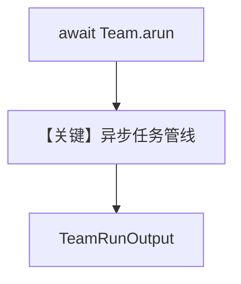

# 07_async_task_mode.py — 实现原理分析

> 源文件：`cookbook/03_teams/02_modes/tasks/07_async_task_mode.py`

## 概述

**TeamMode.tasks** 的 **异步 API**：`await project_team.arun(...)`，适用于 Web 服务等非阻塞场景；成员 Planner / Executor / Reviewer 顺序依赖由指令说明。

**核心配置一览：**

| 配置项 | 值 |
|--------|-----|
| `mode` | `TeamMode.tasks` |
| 入口 | `asyncio.run(main())` → `arun` |

## System Prompt 组装

```text
You are a project team leader.
For each request, follow this workflow:
1. Have the Planner create a plan
2. Have the Executor implement the plan
3. Have the Reviewer check the deliverable
Use task dependencies to enforce the correct ordering.

Use markdown to format your answers.
```

## Mermaid 流程图



- **【关键】异步任务管线**：`arun` 与 `run` 对偶。

## 关键源码文件索引

| 文件 | 作用 |
|------|------|
| `agno/team/team.py` | `arun` 重载 |
