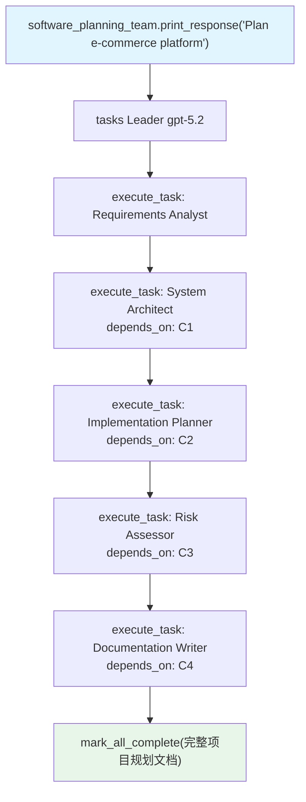

# 08_dependency_chain.py — 实现原理分析

> 源文件：`cookbook/03_teams/02_modes/tasks/08_dependency_chain.py`

## 概述

本示例展示 Agno 的 **tasks 模式五级依赖链**：Requirements Analyst → System Architect → Implementation Planner → Risk Assessor → Documentation Writer，形成完整的软件项目规划流水线。每步任务明确依赖前一步输出，Leader 通过 `execute_task` + `depends_on` 管理整个执行链。

**核心配置一览：**

| 配置项 | 值 | 说明 |
|--------|------|------|
| `name` | `"Software Planning Team"` | Team 名称 |
| `model` | `OpenAIResponses(id="gpt-5.2")` | Leader |
| `mode` | `TeamMode.tasks` | 自主任务模式 |
| `members` | 5 名（见下表） | 全链条角色 |
| `max_iterations` | `15` | 链条较长，上限更高 |
| `show_members_responses` | `True` | 可见每步输出 |

| 成员 | 职责 |
|------|------|
| requirements_analyst | 需求提取与分类 |
| system_architect | 系统架构设计 |
| implementation_planner | 实施计划制定 |
| risk_assessor | 风险识别与缓解 |
| documentation_writer | 综合文档输出 |

## 核心组件解析

### 五级依赖链

```
需求分析（无依赖）
   ↓
系统架构（depends_on: 需求分析）
   ↓
实施计划（depends_on: 系统架构）
   ↓
风险评估（depends_on: 实施计划）
   ↓
文档编写（depends_on: 风险评估）
```

每个节点阻塞直到其所有依赖完成，Leader 在规划阶段一次性声明全部任务和依赖关系，运行时自动按序调度。

### `max_iterations=15` 的意义

链条越长，Leader 所需的工具调用次数越多（每步一次 `execute_task` + 最终一次 `mark_all_complete`）。`max_iterations` 需要大于任务总数，否则流程会被强制中断。

## Mermaid 流程图



## 关键源码文件索引

| 文件 | 关键函数/类 | 作用 |
|------|------------|------|
| `agno/team/_default_tools.py` | `execute_task()` | 顺序任务执行（支持 depends_on） |
| `agno/team/team.py` | `max_iterations` | 防止无限循环的安全阀 |
