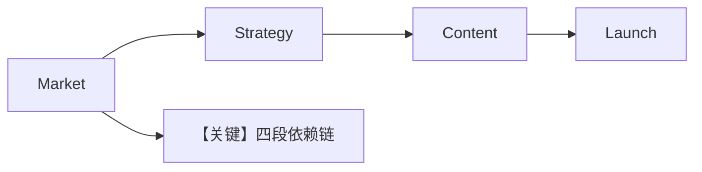

# 08_dependency_chain.py — 实现原理分析

> 源文件：`cookbook/03_teams/02_modes/tasks/08_dependency_chain.py`

## 概述

**长链依赖**：市场研究 → 产品策略 → 文案 → 上线协调；`max_iterations=15`；指令强调 `depends_on` 与 **按完成顺序解锁** 下一任务。

**核心配置一览：**

| 配置项 | 值 |
|--------|-----|
| `mode` | `TeamMode.tasks` |
| `max_iterations` | `15` |

## System Prompt 组装

（见源码 L78–87 完整列表。）

## Mermaid 流程图

```mermaid
flowchart LR
    M1["Market"] --> M2["Strategy"] --> M3["Content"] --> M4["Launch"]
    M1 --> N["【关键】四段依赖链"]
```

- **【关键】四段依赖链**：比 03_dependencies 更长。

## 关键源码文件索引

| 文件 | 作用 |
|------|------|
| `agno/team/team.py` | `max_iterations` |
