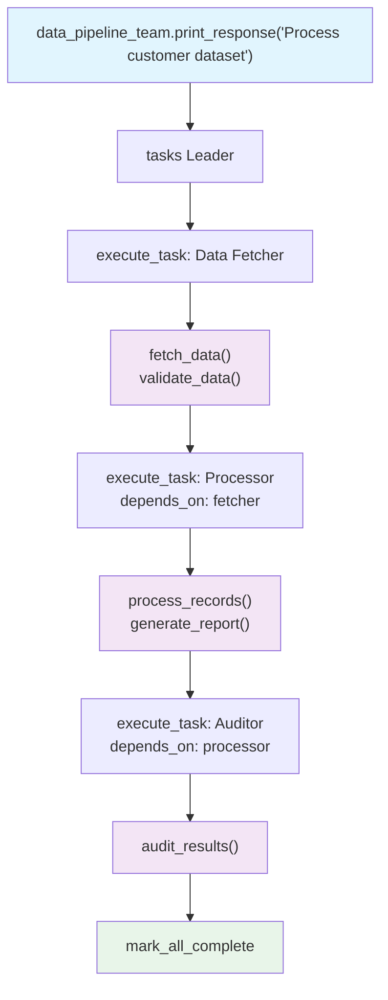

# 09_custom_tools.py — 实现原理分析

> 源文件：`cookbook/03_teams/02_modes/tasks/09_custom_tools.py`

## 概述

本示例展示 Agno 的 **tasks 模式 + 自定义 Python 工具**：Data Fetcher 持有 `fetch_data()` 和 `validate_data()` 两个自定义函数工具，Processor 持有 `process_records()` 和 `generate_report()` 工具，Auditor 持有 `audit_results()` 工具。展示了如何将业务逻辑封装为工具注入 tasks 流程。

**核心配置一览：**

| 配置项 | 值 | 说明 |
|--------|------|------|
| `name` | `"Data Pipeline Team"` | Team 名称 |
| `model` | `OpenAIResponses(id="gpt-5.2")` | Leader |
| `mode` | `TeamMode.tasks` | 自主任务模式 |
| `members` | `[data_fetcher, processor, auditor]` | 三名成员（均有自定义工具） |
| `max_iterations` | `10` | 循环上限 |
| `show_members_responses` | `True` | 显示成员响应 |

## 核心组件解析

### 自定义工具函数示例

```python
def fetch_data(source: str, limit: int = 100) -> str:
    """Fetch data from the specified source"""
    # 业务逻辑：模拟数据库查询/API调用
    return f"Fetched {limit} records from {source}"

def validate_data(data: str) -> str:
    """Validate data integrity"""
    return f"Validation passed: {data}"
```

Agno 自动将 Python 函数转换为 `Function` 工具，通过函数签名和 docstring 生成 JSON Schema，供 LLM 调用。

### 工具与任务的协同

```
data_fetcher（工具: fetch_data, validate_data）
   ↓  execute_task
processor（工具: process_records, generate_report）
   ↓  execute_task（depends_on: fetcher）
auditor（工具: audit_results）
   ↓  execute_task（depends_on: processor）
mark_all_complete
```

每个成员在自己的任务上下文中自主决策调用哪个工具，以及传入什么参数。

## Mermaid 流程图



## 关键源码文件索引

| 文件 | 关键函数/类 | 作用 |
|------|------------|------|
| `agno/tools/function.py` | `Function` | Python 函数→工具转换器 |
| `agno/team/_default_tools.py` | `execute_task()` | 分配任务给工具持有成员 |
