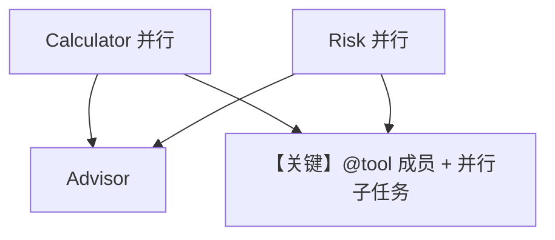

# 09_custom_tools.py — 实现原理分析

> 源文件：`cookbook/03_teams/02_modes/tasks/09_custom_tools.py`

## 概述

**@tool 装饰的 Python 函数** 作为成员工具：`calculate_compound_interest`、`calculate_monthly_payment`、`assess_risk_score`；任务模式下先 **并行** 计算与风险评估，再交给 Advisor 综合（见队长指令 L173–180）。

**核心配置一览：**

| 配置项 | 值 |
|--------|-----|
| `mode` | `TeamMode.tasks` |
| `tools` | `@tool` 函数 |

## 核心组件解析

`agno.tools.tool` 将函数注册为可调用工具；成员 `Financial Calculator` / `Risk Assessor` 分别绑定。

## Mermaid 流程图

```mermaid
flowchart TD
    P1["Calculator 并行"] --> A["Advisor"]
    P2["Risk 并行"] --> A
    P1 --> K["【关键】@tool 成员 + 并行子任务"]
    P2 --> K
```

- **【关键】@tool 成员 + 并行子任务**：定制金融工具链。

## 关键源码文件索引

| 文件 | 作用 |
|------|------|
| `agno/tools/__init__.py` | `@tool` |
