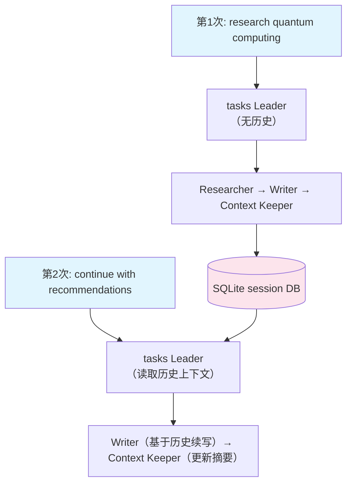

# 10_multi_run_session.py — 实现原理分析

> 源文件：`cookbook/03_teams/02_modes/tasks/10_multi_run_session.py`

## 概述

本示例展示 Agno 的 **tasks 模式 + 持久化会话**：通过 `SqliteDb` + `session_id` 实现多次运行间的上下文记忆。同一 `session_id` 的后续调用可以引用前次任务结果（如"继续上次研究"），Writer 能利用 Context Keeper 的历史摘要直接续写。

**核心配置一览：**

| 配置项 | 值 | 说明 |
|--------|------|------|
| `name` | `"Research Session Team"` | Team 名称 |
| `model` | `OpenAIResponses(id="gpt-5.2")` | Leader |
| `mode` | `TeamMode.tasks` | 自主任务模式 |
| `members` | `[researcher, writer, context_keeper]` | 三名成员 |
| `db` | `SqliteDb(db_file="tmp/tasks_session.db")` | 持久化存储 |
| `session_id` | `"research-session-001"` | 固定会话ID |
| `add_history_to_context` | `True` | Leader 读取历史 |
| `max_iterations` | `10` | 循环上限 |

## 核心组件解析

### 会话持久化机制

```python
team = Team(
    db=SqliteDb(db_file="tmp/tasks_session.db"),
    session_id="research-session-001",
    add_history_to_context=True,
    ...
)
```

- `db` 将每次 run 的消息存入 SQLite
- `session_id` 标识同一会话的多次调用
- `add_history_to_context=True` 让 Leader 在系统消息中附加历史运行摘要

### Context Keeper 成员的作用

Context Keeper 是一个特殊成员，其职责是在任务结束时生成"上下文摘要"，以便下次运行时 Leader 快速理解已完成的工作，避免重复。

### 多次运行示例

```python
# 第一次运行
team.print_response("Research quantum computing applications")

# 第二次运行（同一 session_id，Leader 有历史上下文）
team.print_response("Continue with implementation recommendations")
```

## Mermaid 流程图



## 关键源码文件索引

| 文件 | 关键函数/类 | 作用 |
|------|------------|------|
| `agno/db/sqlite.py` | `SqliteDb` | 会话持久化存储 |
| `agno/team/team.py` | `session_id`, `add_history_to_context` | 多次运行会话管理 |
