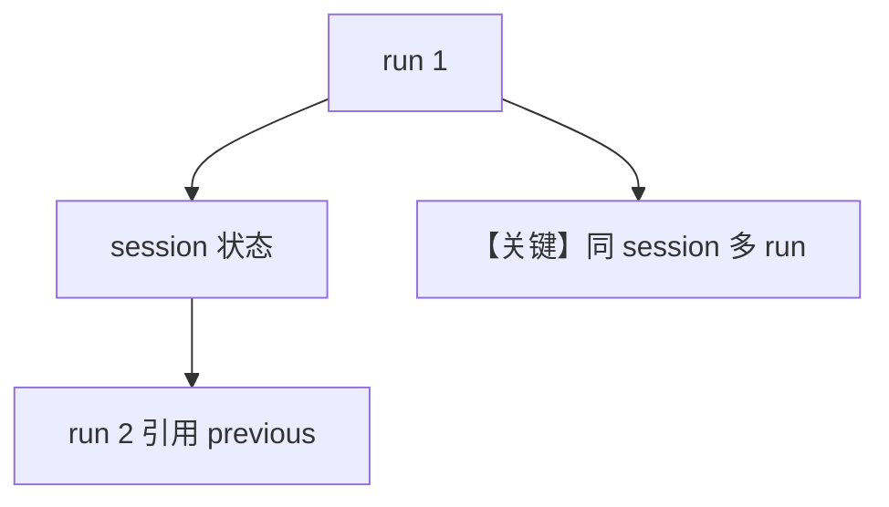

# 10_multi_run_session.py — 实现原理分析

<!-- cookbook-py-source:start -->
## 完整源码

```python
"""
Multi-Run Session with Task Mode

Demonstrates that task state persists across multiple runs within the same
session. The first run creates and executes tasks; the second run can
reference prior task results.

Run: .venvs/demo/bin/python cookbook/03_teams/02_modes/tasks/10_multi_run_session.py
"""

from agno.agent import Agent
from agno.models.openai import OpenAIResponses
from agno.team.mode import TeamMode
from agno.team.team import Team

# ---------------------------------------------------------------------------
# Create Members
# ---------------------------------------------------------------------------

researcher = Agent(
    name="Researcher",
    role="Research specialist",
    model=OpenAIResponses(id="gpt-5-mini"),
    instructions=["Provide concise, factual research summaries."],
)

analyst = Agent(
    name="Analyst",
    role="Data analyst who draws conclusions from research",
    model=OpenAIResponses(id="gpt-5-mini"),
    instructions=["Analyze data and draw actionable conclusions."],
)

# ---------------------------------------------------------------------------
# Create Team
# ---------------------------------------------------------------------------

team = Team(
    name="Research Analysis Team",
    mode=TeamMode.tasks,
    model=OpenAIResponses(id="gpt-5.2"),
    members=[researcher, analyst],
    session_id="task-mode-demo-session",
    instructions=[
        "You are a research and analysis team leader.",
        "Decompose requests into research and analysis tasks.",
    ],
    show_members_responses=True,
    markdown=True,
    max_iterations=8,
)

# ---------------------------------------------------------------------------
# Run Team
# ---------------------------------------------------------------------------

if __name__ == "__main__":
    print("=" * 60)
    print("RUN 1: Initial research")
    print("=" * 60)
    response1 = team.run(
        "Research the pros and cons of microservices architecture "
        "vs monolithic architecture for a startup."
    )
    print(response1.content)

    print("\n" + "=" * 60)
    print("RUN 2: Follow-up request (same session)")
    print("=" * 60)
    response2 = team.run(
        "Based on the previous analysis, which architecture would you "
        "recommend for a team of 5 engineers building a B2B SaaS product? "
        "Provide a concrete recommendation."
    )
    print(response2.content)
```

<!-- cookbook-py-source:end -->

> 源文件：`cookbook/03_teams/02_modes/tasks/10_multi_run_session.py`

## 概述

**固定 `session_id`** 下 **多次 `team.run`**：第一轮研究生成任务结果；第二轮 follow-up **引用上一轮分析**，展示任务模式在会话内的状态延续（依赖 Team session 存储）。

**核心配置一览：**

| 配置项 | 值 |
|--------|-----|
| `session_id` | `"task-mode-demo-session"` |
| `mode` | `TeamMode.tasks` |

## 运行机制与因果链

无显式 `db` 时 session 行为以框架默认为准；本例意图是 **同 session 多 run** 的连贯性。

## Mermaid 流程图


```mermaid
flowchart TD
    R1["run 1"] --> S["session 状态"]
    S --> R2["run 2 引用 previous"]
    R1 --> K["【关键】同 session 多 run"]
```

- **【关键】同 session 多 run**：任务历史可跨 run。

## 关键源码文件索引

| 文件 | 作用 |
|------|------|
| `agno/team/team.py` | `session_id` L115-116 |
