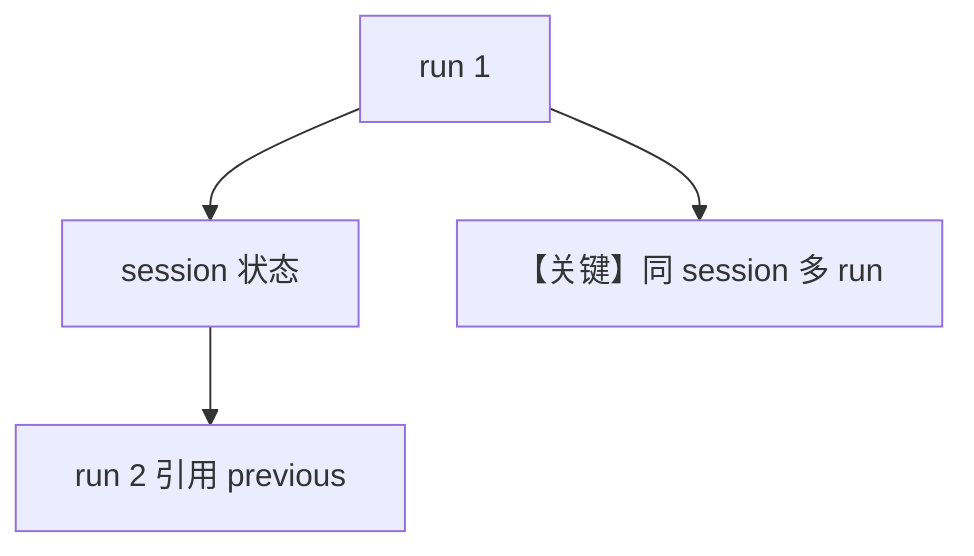

# 10_multi_run_session.py — 实现原理分析

> 源文件：`cookbook/03_teams/02_modes/tasks/10_multi_run_session.py`

## 概述

**固定 `session_id`** 下 **多次 `team.run`**：第一轮研究生成任务结果；第二轮 follow-up **引用上一轮分析**，展示任务模式在会话内的状态延续（依赖 Team session 存储）。

**核心配置一览：**

| 配置项 | 值 |
|--------|-----|
| `session_id` | `"task-mode-demo-session"` |
| `mode` | `TeamMode.tasks` |

## 运行机制与因果链

无显式 `db` 时 session 行为以框架默认为准；本例意图是 **同 session 多 run** 的连贯性。

## Mermaid 流程图

```mermaid
flowchart TD
    R1["run 1"] --> S["session 状态"]
    S --> R2["run 2 引用 previous"]
    R1 --> K["【关键】同 session 多 run"]
```

- **【关键】同 session 多 run**：任务历史可跨 run。

## 关键源码文件索引

| 文件 | 作用 |
|------|------|
| `agno/team/team.py` | `session_id` L115-116 |
