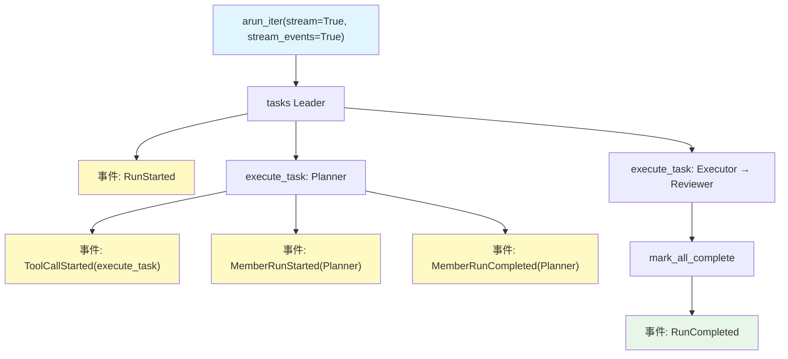

# 11_streaming_events.py — 实现原理分析

> 源文件：`cookbook/03_teams/02_modes/tasks/11_streaming_events.py`

## 概述

本示例展示 Agno 的 **tasks 模式 + 细粒度事件流**：通过 `stream=True` + `stream_events=True` + `stream_member_events=True` 实时捕获任务生命周期事件。开发者可在事件回调中观察 `TaskIterationStartedEvent`、`RunStarted`、`ToolCallStarted` 等，适用于构建带进度显示的 UI 或调试复杂任务流。

**核心配置一览：**

| 配置项 | 值 | 说明 |
|--------|------|------|
| `name` | `"Event Stream Team"` | Team 名称 |
| `model` | `OpenAIResponses(id="gpt-5.2")` | Leader |
| `mode` | `TeamMode.tasks` | 自主任务模式 |
| `members` | `[planner, executor, reviewer]` | 三名成员（均开启 stream） |
| `stream_member_events` | `True` | 成员事件传播至 Team 事件流 |
| `show_members_responses` | `True` | 显示成员响应 |
| `max_iterations` | `10` | 循环上限 |

## 核心组件解析

### 事件流消费模式

```python
async def main():
    async for event in await team.arun_iter(query, stream=True, stream_events=True):
        if event.event == "RunStarted":
            print("Team started")
        elif event.event == "TaskIterationStartedEvent":
            print(f"Task iteration: {event.iteration}")
        elif event.event == "ToolCallStarted":
            print(f"Tool called: {event.tool_name}")
        elif event.event == "RunCompleted":
            print("All tasks done")
```

### 关键事件类型

| 事件 | 含义 |
|------|------|
| `RunStarted` | Team 开始执行 |
| `TaskIterationStartedEvent` | Leader 开始新一轮任务规划/调度 |
| `ToolCallStarted` | Leader 或成员调用工具（如 `execute_task`） |
| `ToolCallCompleted` | 工具调用完成 |
| `RunCompleted` | 整个任务流完成 |
| `MemberRunStarted` | 成员 Agent 开始执行（需 `stream_member_events=True`） |
| `MemberRunCompleted` | 成员 Agent 执行完成 |

### `stream_member_events=True` 的效果

不加此配置时，只能看到 Leader 的事件；加上后，成员 Agent 的内部事件（如工具调用）也会冒泡至 Team 的事件流，实现全链路可观测。

## Mermaid 流程图



## 关键源码文件索引

| 文件 | 关键函数/类 | 作用 |
|------|------------|------|
| `agno/team/team.py` | `stream_member_events` | 成员事件传播控制 |
| `agno/team/team.py` | `arun_iter()` | 异步事件迭代器 |
| `agno/run/response.py` | `RunEvent` | 事件类型定义 |
