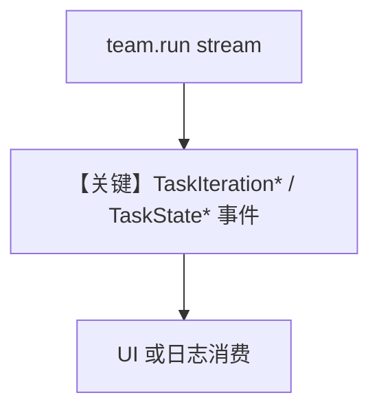

# 11_streaming_events.py — 实现原理分析

> 源文件：`cookbook/03_teams/02_modes/tasks/11_streaming_events.py`

## 概述

**TeamMode.tasks + stream + stream_events**：`team.run(..., stream=True, stream_events=True)` 迭代 `TaskIterationStartedEvent`、`TaskIterationCompletedEvent`、`TaskStateUpdatedEvent`、`ToolCallStartedEvent` 等（`agno/run/team.py`），用于可编程观测任务迭代与工具调用；兼容成员侧 `AgentRunContentEvent` 与队长 `RunContentEvent`。

**核心配置一览：**

| 配置项 | 值 |
|--------|-----|
| `mode` | `TeamMode.tasks` |
| `stream` / `stream_events` | `True` |
| `max_iterations` | `3` |

## 完整 API 请求

底层仍为 `OpenAIResponses`；事件层为 Agno 封装。

## Mermaid 流程图

```mermaid
flowchart TD
    S["team.run stream"] --> E["【关键】TaskIteration* / TaskState* 事件"]
    E --> U["UI 或日志消费"]
```

- **【关键】TaskIteration* / TaskState* 事件**：任务模式可观测性。

## 关键源码文件索引

| 文件 | 作用 |
|------|------|
| `agno/run/team.py` | `TaskIterationStartedEvent` 等 |
