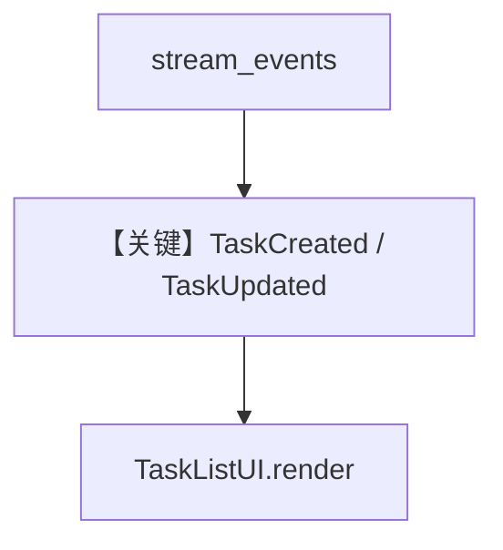

# tasks_stream.py — 实现原理分析

> 源文件：`cookbook/03_teams/02_modes/tasks_stream.py`

## 概述

本示例展示 **TaskCreatedEvent / TaskUpdatedEvent** 等 **专用任务事件**，用于前端实时任务列表而无需解析工具返回；`OpenAIChat`（gpt-4o / gpt-4o-mini）与 **Chat Completions** 路径；`TaskListUI` 模拟前端状态机。

**核心配置一览：**

| 配置项 | 值 |
|--------|-----|
| `mode` | `TeamMode.tasks` |
| `model` | `OpenAIChat(id="gpt-4o")` 队长；成员 `gpt-4o-mini` |
| `max_iterations` | `5` |

## 核心组件解析

循环 `team.run(stream=True, stream_events=True)`，对 `TaskCreatedEvent` 调 `add_task`，对 `TaskUpdatedEvent` 更新状态；`TaskStateUpdatedEvent` 在 `goal_complete` 时打印全列表。

## System Prompt 组装

队长 instructions（L95–101）要求拆成 **多条** 任务。

### 还原后的完整 System 文本（核心）

```text
You are a content creation team leader.
IMPORTANT: Break down the user's request into MULTIPLE separate tasks.
Create at least 3-4 distinct tasks for complex requests.
Assign tasks to the appropriate team member.
Execute tasks one by one and track progress.
```

## 完整 API 请求

`OpenAIChat` → `chat.completions.create`（非 Responses）。

## Mermaid 流程图



- **【关键】TaskCreated / TaskUpdated**：结构化任务列表事件。

## 关键源码文件索引

| 文件 | 作用 |
|------|------|
| `agno/run/team.py` | `TaskCreatedEvent`, `TaskUpdatedEvent` |
| `agno/models/openai/chat.py` | `OpenAIChat` invoke |
