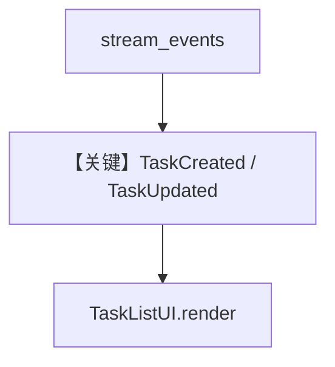

# tasks_stream.py — 实现原理分析

<!-- cookbook-py-source:start -->
## 完整源码

```python
"""
Task Mode Streaming Example - Real-time Task List with Dedicated Events
=========================================================================

This example demonstrates how to show a REAL-TIME task list using the NEW
dedicated task events:

- TaskCreatedEvent: Emitted immediately when a task is created
- TaskUpdatedEvent: Emitted immediately when a task status changes

NO MORE parsing tool call results! The frontend gets clean, structured events.
"""

from typing import Dict

from agno.agent import Agent
from agno.models.openai import OpenAIChat
from agno.run.team import (
    TaskCreatedEvent,
    TaskIterationStartedEvent,
    TaskStateUpdatedEvent,
    TaskUpdatedEvent,
)
from agno.team.mode import TeamMode
from agno.team.team import Team


# Simulated frontend task list state
class TaskListUI:
    """Simulates a frontend task list component that updates in real-time."""

    def __init__(self):
        self.tasks: Dict[str, dict] = {}  # task_id -> task_data

    def render(self):
        """Render the current task list state."""
        if not self.tasks:
            print("  (No tasks yet)")
            return

        for task_id, task in self.tasks.items():
            status_icons = {
                "pending": "[ ]",
                "in_progress": "[~]",
                "completed": "[x]",
                "failed": "[!]",
                "blocked": "[-]",
            }
            icon = status_icons.get(task.get("status", "pending"), "[ ]")
            title = task.get("title", "Untitled")
            assignee = task.get("assignee", "")
            assignee_str = f" ({assignee})" if assignee else ""
            print(f"  {icon} {title}{assignee_str}")

    def add_task(
        self, task_id: str, title: str, assignee: str = None, status: str = "pending"
    ):
        """Add a new task to the list."""
        self.tasks[task_id] = {
            "title": title,
            "assignee": assignee,
            "status": status,
        }

    def update_status(self, task_id: str, status: str, result: str = None):
        """Update a task's status."""
        if task_id in self.tasks:
            self.tasks[task_id]["status"] = status
            if result:
                self.tasks[task_id]["result"] = result


def main():
    # Create member agents
    researcher = Agent(
        name="Researcher",
        role="Research specialist",
        model=OpenAIChat(id="gpt-4o-mini"),
        instructions="You research topics and provide information.",
    )

    writer = Agent(
        name="Writer",
        role="Content writer",
        model=OpenAIChat(id="gpt-4o-mini"),
        instructions="You write content based on research.",
    )

    # Create team in tasks mode
    team = Team(
        name="Content Team",
        mode=TeamMode.tasks,
        model=OpenAIChat(id="gpt-4o"),
        members=[researcher, writer],
        instructions=[
            "You are a content creation team leader.",
            "IMPORTANT: Break down the user's request into MULTIPLE separate tasks.",
            "Create at least 3-4 distinct tasks for complex requests.",
            "Assign tasks to the appropriate team member.",
            "Execute tasks one by one and track progress.",
        ],
        max_iterations=5,
    )

    print("=" * 60)
    print("REAL-TIME TASK LIST - Using Dedicated Task Events!")
    print("=" * 60)
    print()
    print("Events used:")
    print("  - TaskCreatedEvent: When a task is created")
    print("  - TaskUpdatedEvent: When a task status changes")
    print("  - TaskStateUpdatedEvent: Full task list snapshot")
    print()

    # Frontend task list state
    task_ui = TaskListUI()

    # A more complex request that should generate multiple tasks
    request = """Create a mini blog post about "The Future of AI in Healthcare" with:
1. Research the current state of AI in healthcare
2. Research future predictions and trends  
3. Write an introduction paragraph
4. Write a main body paragraph
5. Write a conclusion paragraph"""

    # Run with streaming events
    for event in team.run(
        request,
        stream=True,
        stream_events=True,
    ):
        # NEW: Handle TaskCreatedEvent - clean, no parsing needed!
        if isinstance(event, TaskCreatedEvent):
            task_ui.add_task(
                task_id=event.task_id,
                title=event.title,
                assignee=event.assignee,
                status=event.status,
            )
            print(f"\n+ Task created: {event.title}")
            print(f"  ID: {event.task_id}, Assignee: {event.assignee or 'unassigned'}")
            print("-" * 40)
            task_ui.render()
            print("-" * 40)

        # NEW: Handle TaskUpdatedEvent - clean status updates!
        elif isinstance(event, TaskUpdatedEvent):
            task_ui.update_status(
                task_id=event.task_id,
                status=event.status,
                result=event.result,
            )
            if event.status == "in_progress":
                print(f"\n~ Executing: {event.title}...")
            elif event.status == "completed":
                print(f"\n* Completed: {event.title}")
                print("-" * 40)
                task_ui.render()
                print("-" * 40)
            elif event.status == "failed":
                print(f"\n! Failed: {event.title}")
                print(f"  Error: {event.result}")
                print("-" * 40)
                task_ui.render()
                print("-" * 40)

        # Handle iteration events
        elif isinstance(event, TaskIterationStartedEvent):
            print(f"\n>>> Iteration {event.iteration}/{event.max_iterations}")

        # Final state from TaskStateUpdatedEvent
        elif isinstance(event, TaskStateUpdatedEvent):
            if event.goal_complete:
                print("\n" + "=" * 60)
                print("GOAL COMPLETE!")
                print("=" * 60)
                if event.completion_summary:
                    print(f"Summary: {event.completion_summary[:200]}...")
                print()
                print("Final task list (from TaskStateUpdatedEvent):")
                print("-" * 40)
                for task in event.tasks:
                    status_icons = {
                        "pending": "[ ]",
                        "in_progress": "[~]",
                        "completed": "[x]",
                        "failed": "[!]",
                        "blocked": "[-]",
                    }
                    icon = status_icons.get(task.status, "[ ]")
                    assignee_str = f" ({task.assignee})" if task.assignee else ""
                    print(f"  {icon} {task.title}{assignee_str}")
                print("-" * 40)

    print()
    print("=" * 60)
    print("DEMO COMPLETE")
    print("=" * 60)
    print()
    print("The frontend now receives dedicated events:")
    print("  - TaskCreatedEvent: task_id, title, description, assignee, status")
    print("  - TaskUpdatedEvent: task_id, title, status, previous_status, result")
    print()
    print("No more parsing tool call results!")


if __name__ == "__main__":
    main()
```

<!-- cookbook-py-source:end -->

> 源文件：`cookbook/03_teams/02_modes/tasks_stream.py`

## 概述

本示例展示 **TaskCreatedEvent / TaskUpdatedEvent** 等 **专用任务事件**，用于前端实时任务列表而无需解析工具返回；`OpenAIChat`（gpt-4o / gpt-4o-mini）与 **Chat Completions** 路径；`TaskListUI` 模拟前端状态机。

**核心配置一览：**

| 配置项 | 值 |
|--------|-----|
| `mode` | `TeamMode.tasks` |
| `model` | `OpenAIChat(id="gpt-4o")` 队长；成员 `gpt-4o-mini` |
| `max_iterations` | `5` |

## 核心组件解析

循环 `team.run(stream=True, stream_events=True)`，对 `TaskCreatedEvent` 调 `add_task`，对 `TaskUpdatedEvent` 更新状态；`TaskStateUpdatedEvent` 在 `goal_complete` 时打印全列表。

## System Prompt 组装

队长 instructions（L95–101）要求拆成 **多条** 任务。

### 还原后的完整 System 文本（核心）

```text
You are a content creation team leader.
IMPORTANT: Break down the user's request into MULTIPLE separate tasks.
Create at least 3-4 distinct tasks for complex requests.
Assign tasks to the appropriate team member.
Execute tasks one by one and track progress.
```

## 完整 API 请求

`OpenAIChat` → `chat.completions.create`（非 Responses）。

## Mermaid 流程图



- **【关键】TaskCreated / TaskUpdated**：结构化任务列表事件。

## 关键源码文件索引

| 文件 | 作用 |
|------|------|
| `agno/run/team.py` | `TaskCreatedEvent`, `TaskUpdatedEvent` |
| `agno/models/openai/chat.py` | `OpenAIChat` invoke |
