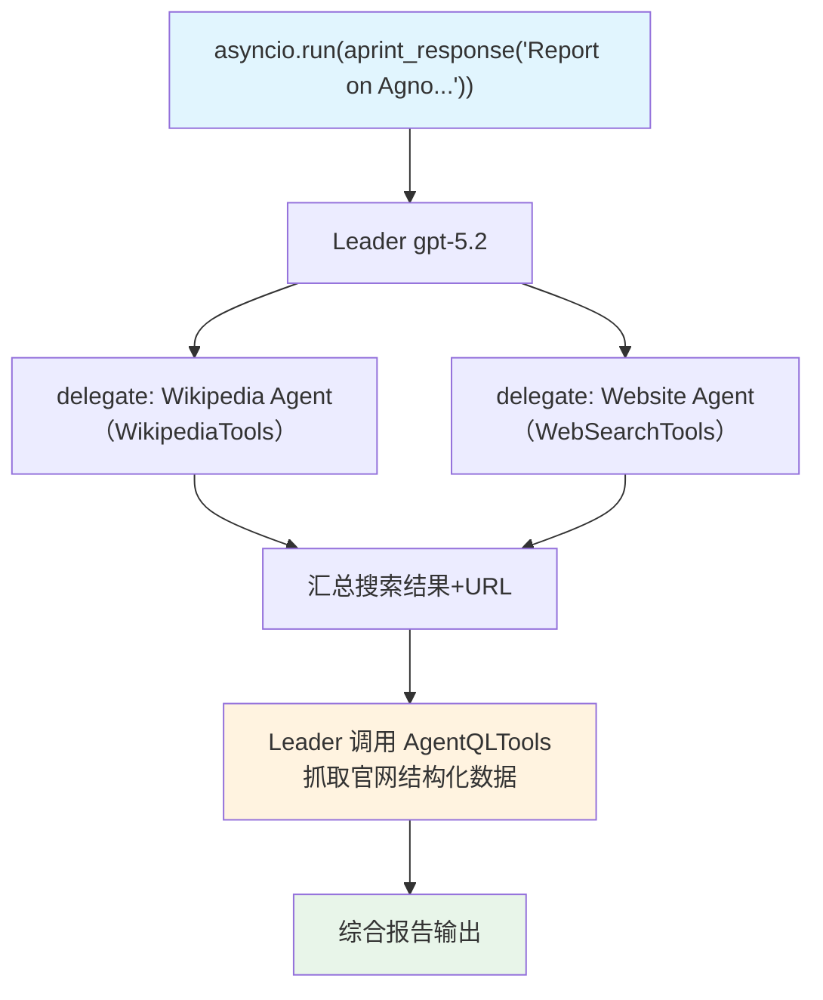

# async_tools.py — 实现原理分析

> 源文件：`cookbook/03_teams/03_tools/async_tools.py`

## 概述

本示例展示 Agno Team 的 **异步执行 + 多工具组合**：Company Info Team 在 Leader 级挂载 AgentQLTools（网页抓取），Wikipedia Agent 持有 WikipediaTools，Website Agent 持有 WebSearchTools。Leader 先协调成员搜索，再自主调用 AgentQL 抓取官网，通过 `aprint_response` 实现全程异步。

**核心配置一览：**

| 配置项 | 值 | 说明 |
|--------|------|------|
| `name` | `"Company Info Team"` | Team 名称 |
| `model` | `OpenAIResponses(id="gpt-5.2")` | Leader |
| `tools` | `[AgentQLTools(agentql_query=custom_query)]` | Leader 级网页抓取工具 |
| `members` | `[wikipedia_agent, website_agent]` | 搜索成员 |
| `id` | `str(uuid4())` | 自定义 Team ID |

## 核心组件解析

### 工具分层设计

```
Team Leader（AgentQLTools） ← 抓取官网结构化数据
    ├── Wikipedia Agent（WikipediaTools） ← 搜索百科
    └── Website Agent（WebSearchTools） ← 搜索网页
```

- **成员工具**：成员自主使用，搜索初步信息
- **Leader 工具**：基于成员搜索结果（获得 URL 后），Leader 用 AgentQL 抓取结构化内容

### AgentQL 自定义查询

```python
custom_query = """
{
    title
    text_content[]
}
"""
```

AgentQL 用语义查询语言提取网页特定字段，类似 GraphQL，避免解析复杂 HTML。

### 异步执行

```python
asyncio.run(
    company_info_team.aprint_response("...", stream=True)
)
```

`aprint_response` 是 `print_response` 的异步版本，允许成员 Agent 的 API 调用并发执行，不阻塞事件循环。

## Mermaid 流程图



## 关键源码文件索引

| 文件 | 关键函数/类 | 作用 |
|------|------------|------|
| `agno/tools/agentql.py` | `AgentQLTools` | 语义网页抓取工具 |
| `agno/tools/wikipedia.py` | `WikipediaTools` | 百科搜索工具 |
| `agno/team/team.py` | `aprint_response()` | 异步打印响应 |
