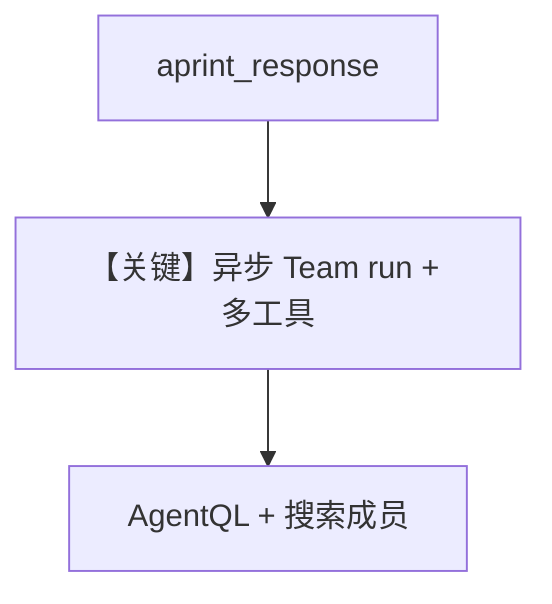

# async_tools.py — 实现原理分析

<!-- cookbook-py-source:start -->
## 完整源码

```python
"""
Async Tools
===========

Demonstrates async team execution with mixed research and scraping tools.
"""

import asyncio
from uuid import uuid4

from agno.agent import Agent
from agno.models.openai import OpenAIResponses
from agno.team import Team
from agno.tools.agentql import AgentQLTools
from agno.tools.websearch import WebSearchTools
from agno.tools.wikipedia import WikipediaTools

# ---------------------------------------------------------------------------
# Setup
# ---------------------------------------------------------------------------
custom_query = """
{
    title
    text_content[]
}
"""

# ---------------------------------------------------------------------------
# Create Members
# ---------------------------------------------------------------------------
wikipedia_agent = Agent(
    name="Wikipedia Agent",
    role="Search wikipedia for information",
    model=OpenAIResponses(id="gpt-5-mini"),
    tools=[WikipediaTools()],
    instructions=[
        "Find information about the company in the wikipedia",
    ],
)

website_agent = Agent(
    name="Website Agent",
    role="Search the website for information",
    model=OpenAIResponses(id="gpt-5-mini"),
    tools=[WebSearchTools()],
    instructions=[
        "Search the website for information",
    ],
)

# ---------------------------------------------------------------------------
# Create Team
# ---------------------------------------------------------------------------
user_id = str(uuid4())
team_id = str(uuid4())

company_info_team = Team(
    name="Company Info Team",
    id=team_id,
    model=OpenAIResponses(id="gpt-5.2"),
    tools=[AgentQLTools(agentql_query=custom_query)],
    members=[wikipedia_agent, website_agent],
    markdown=True,
    instructions=[
        "You are a team that finds information about a company.",
        "First search the web and wikipedia for information about the company.",
        "If you can find the company's website URL, then scrape the homepage and the about page.",
    ],
    show_members_responses=True,
)

# ---------------------------------------------------------------------------
# Run Team
# ---------------------------------------------------------------------------
if __name__ == "__main__":
    asyncio.run(
        company_info_team.aprint_response(
            "Write me a full report on everything you can find about Agno, the company building AI agent infrastructure.",
            stream=True,
        )
    )
```

<!-- cookbook-py-source:end -->

> 源文件：`cookbook/03_teams/03_tools/async_tools.py`

## 概述

**Team 层工具 + 成员工具混合**：队长配备 `AgentQLTools(agentql_query=...)`，成员 `WikipediaTools` / `WebSearchTools`；**异步入口** `asyncio.run(company_info_team.aprint_response(...))` 演示非阻塞团队执行。

**核心配置一览：**

| 配置项 | 值 |
|--------|-----|
| `tools` | `[AgentQLTools(...)]`（Team 级） |
| `members` | 两 Agent，各带检索工具 |
| `id` / `user_id` | 可选 UUID |

## Mermaid 流程图


```mermaid
flowchart TD
    A["aprint_response"] --> B["【关键】异步 Team run + 多工具"]
    B --> C["AgentQL + 搜索成员"]
```

- **【关键】异步 Team run + 多工具**：`aprint_response` 与工具链。

## 关键源码文件索引

| 文件 | 作用 |
|------|------|
| `agno/team/team.py` | `aprint_response` / `arun` |
| `agno/tools/agentql` | `AgentQLTools` |
