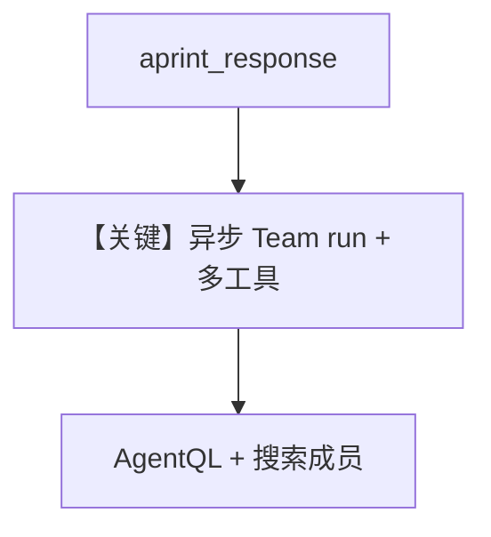

# async_tools.py — 实现原理分析

> 源文件：`cookbook/03_teams/03_tools/async_tools.py`

## 概述

**Team 层工具 + 成员工具混合**：队长配备 `AgentQLTools(agentql_query=...)`，成员 `WikipediaTools` / `WebSearchTools`；**异步入口** `asyncio.run(company_info_team.aprint_response(...))` 演示非阻塞团队执行。

**核心配置一览：**

| 配置项 | 值 |
|--------|-----|
| `tools` | `[AgentQLTools(...)]`（Team 级） |
| `members` | 两 Agent，各带检索工具 |
| `id` / `user_id` | 可选 UUID |

## Mermaid 流程图

```mermaid
flowchart TD
    A["aprint_response"] --> B["【关键】异步 Team run + 多工具"]
    B --> C["AgentQL + 搜索成员"]
```

- **【关键】异步 Team run + 多工具**：`aprint_response` 与工具链。

## 关键源码文件索引

| 文件 | 作用 |
|------|------|
| `agno/team/team.py` | `aprint_response` / `arun` |
| `agno/tools/agentql` | `AgentQLTools` |
