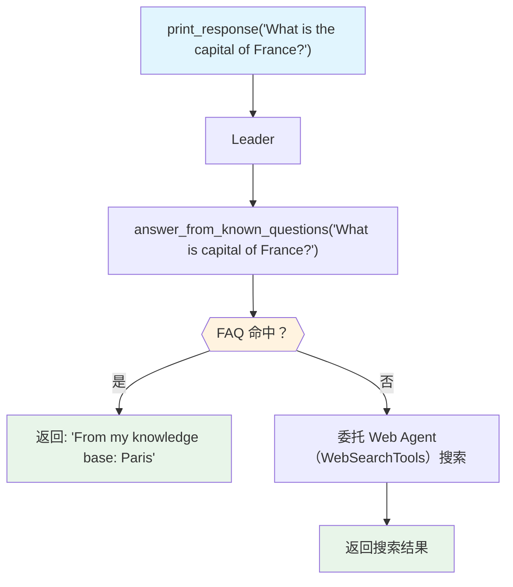

# custom_tools.py — 实现原理分析

> 源文件：`cookbook/03_teams/03_tools/custom_tools.py`

## 概述

本示例展示 Agno Team 的 **Leader 级自定义工具 + 成员工具降级**：Team Leader 优先使用 `answer_from_known_questions`（内置 FAQ 工具）直接回答，当 FAQ 无法回答时，再委托 Web Agent 使用 WebSearchTools 进行网络搜索。这是"本地缓存优先，网络搜索兜底"的工具设计模式。

**核心配置一览：**

| 配置项 | 值 | 说明 |
|--------|------|------|
| `name` | `"Q & A team"` | Team 名称 |
| `tools` | `[answer_from_known_questions]` | Leader 级 FAQ 工具 |
| `members` | `[web_agent]`（持有 WebSearchTools） | 网络搜索兜底 |

## 核心组件解析

### `@tool()` 装饰器

```python
@tool()
def answer_from_known_questions(question: str) -> str:
    """Answer a question from a small built-in FAQ."""
    ...
    return "I don't have that information. Try asking the web search agent."
```

`@tool()` 将 Python 函数包装为 Agno `Function` 工具，自动从函数签名和 docstring 生成 JSON Schema。

### 工具降级逻辑

1. 用户提问 → Leader 调用 `answer_from_known_questions`
2. FAQ 命中 → 直接返回（无需成员参与）
3. FAQ 未命中（返回提示文本）→ Leader 委托 Web Agent 搜索

Leader 根据工具返回内容中的提示语（"Try asking the web search agent"）决策是否委托成员。

### 运行时元信息

示例还演示了访问 Team 的运行时状态：

```python
print(f"Session ID: {team.session_id}")
print(f"Session State: {team.session_state}")
for t in team.tools:
    print(f"  - {t.name}: {t.description}")
```

## Mermaid 流程图



## 关键源码文件索引

| 文件 | 关键函数/类 | 作用 |
|------|------------|------|
| `agno/tools/__init__.py` | `@tool()` | 函数→工具装饰器 |
| `agno/tools/websearch.py` | `WebSearchTools` | 网络搜索工具 |
