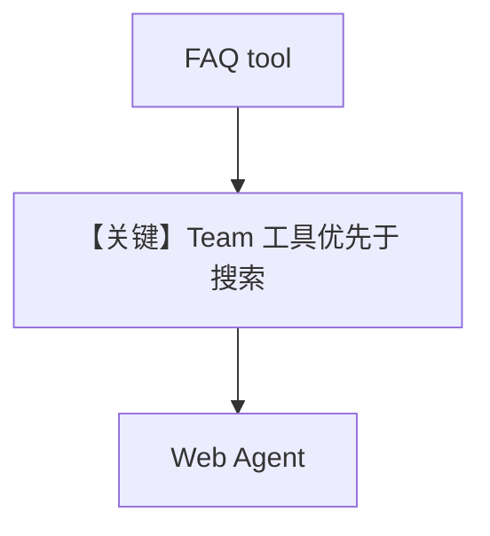

# custom_tools.py — 实现原理分析

<!-- cookbook-py-source:start -->
## 完整源码

```python
"""
Custom Tools
============

Demonstrates a team using a custom FAQ tool plus web-search fallback.
"""

from agno.agent import Agent
from agno.team import Team
from agno.tools import tool
from agno.tools.websearch import WebSearchTools


@tool()
def answer_from_known_questions(question: str) -> str:
    """Answer a question from a small built-in FAQ."""
    faq = {
        "What is the capital of France?": "Paris",
        "What is the capital of Germany?": "Berlin",
        "What is the capital of Italy?": "Rome",
        "What is the capital of Spain?": "Madrid",
        "What is the capital of Portugal?": "Lisbon",
        "What is the capital of Greece?": "Athens",
        "What is the capital of Turkey?": "Ankara",
    }

    if question in faq:
        return f"From my knowledge base: {faq[question]}"
    return "I don't have that information in my knowledge base. Try asking the web search agent."


# ---------------------------------------------------------------------------
# Create Members
# ---------------------------------------------------------------------------
web_agent = Agent(
    name="Web Agent",
    role="Search the web for information",
    tools=[WebSearchTools()],
    markdown=True,
)

# ---------------------------------------------------------------------------
# Create Team
# ---------------------------------------------------------------------------
team = Team(
    name="Q & A team",
    members=[web_agent],
    tools=[answer_from_known_questions],
)

# ---------------------------------------------------------------------------
# Run Team
# ---------------------------------------------------------------------------
if __name__ == "__main__":
    team.print_response("What is the capital of France?", stream=True)

    print("\nTeam Session Info:")
    print(f"   Session ID: {team.session_id}")
    print(f"   Session State: {team.session_state}")

    print("\nTeam Tools Available:")
    for t in team.tools:
        print(f"   - {t.name}: {t.description}")

    print("\nTeam Members:")
    for member in team.members:
        print(f"   - {member.name}: {member.role}")
```

<!-- cookbook-py-source:end -->

> 源文件：`cookbook/03_teams/03_tools/custom_tools.py`

## 概述

**Team 级 `@tool` FAQ** 与 **成员 WebSearchTools**：队长可先调 `answer_from_known_questions`，否则成员搜索；`Team` 未显式设置 `model` 时依赖框架默认（需运行时确认）。

**核心配置一览：**

| 配置项 | 值 |
|--------|-----|
| `tools` | `[answer_from_known_questions]` |
| `members` | `[web_agent]` 带 `WebSearchTools` |

## System Prompt 组装

无显式 `instructions`；完整队长 system 由默认拼装决定，可运行时打印 `get_system_message`。

## Mermaid 流程图


```mermaid
flowchart TD
    F["FAQ tool"] --> W["【关键】Team 工具优先于搜索"]
    W --> M["Web Agent"]
```

- **【关键】Team 工具优先于搜索**：内置知识命中则短路径。

## 关键源码文件索引

| 文件 | 作用 |
|------|------|
| `agno/tools` | `@tool` |
