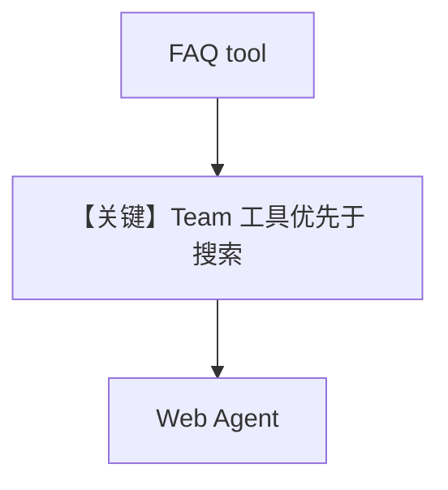

# custom_tools.py — 实现原理分析

> 源文件：`cookbook/03_teams/03_tools/custom_tools.py`

## 概述

**Team 级 `@tool` FAQ** 与 **成员 WebSearchTools**：队长可先调 `answer_from_known_questions`，否则成员搜索；`Team` 未显式设置 `model` 时依赖框架默认（需运行时确认）。

**核心配置一览：**

| 配置项 | 值 |
|--------|-----|
| `tools` | `[answer_from_known_questions]` |
| `members` | `[web_agent]` 带 `WebSearchTools` |

## System Prompt 组装

无显式 `instructions`；完整队长 system 由默认拼装决定，可运行时打印 `get_system_message`。

## Mermaid 流程图

```mermaid
flowchart TD
    F["FAQ tool"] --> W["【关键】Team 工具优先于搜索"]
    W --> M["Web Agent"]
```

- **【关键】Team 工具优先于搜索**：内置知识命中则短路径。

## 关键源码文件索引

| 文件 | 作用 |
|------|------|
| `agno/tools` | `@tool` |
