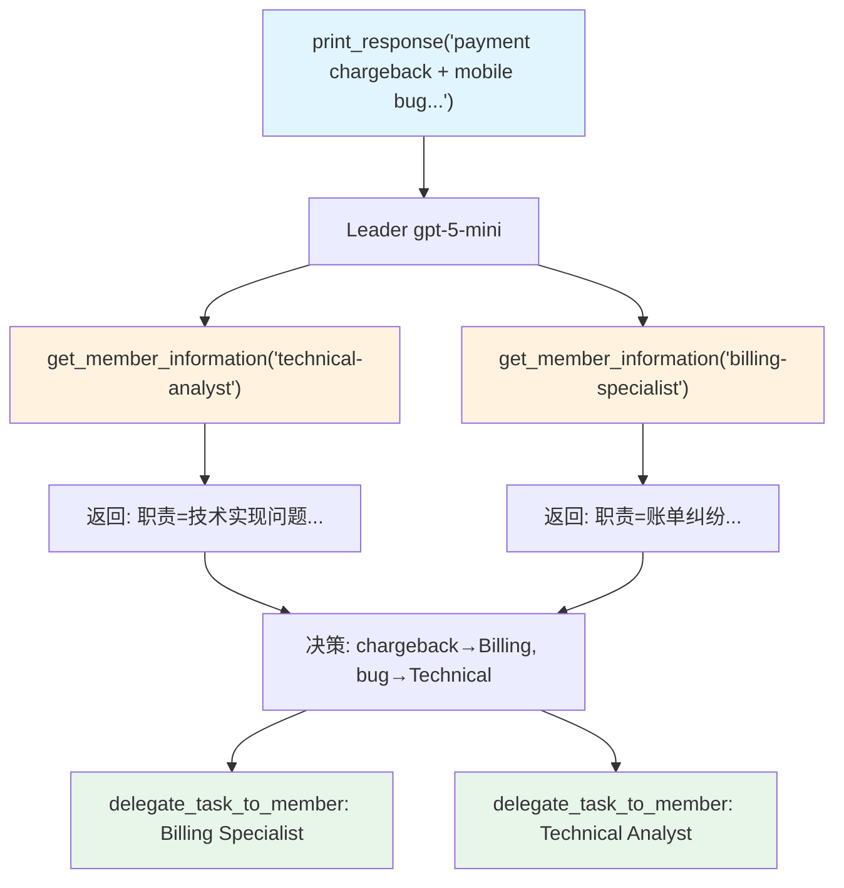

# member_information.py — 实现原理分析

> 源文件：`cookbook/03_teams/03_tools/member_information.py`

## 概述

本示例展示 Agno Team 的 **`get_member_information_tool` 动态成员查询**：Leader 在路由前可调用此工具查询每个成员的详细能力描述，从而做出更精确的路由决策，而不仅依赖系统提示中的静态成员列表。

**核心配置一览：**

| 配置项 | 值 | 说明 |
|--------|------|------|
| `name` | `"Support Coordination Team"` | Team 名称 |
| `model` | `OpenAIResponses(id="gpt-5-mini")` | Leader |
| `get_member_information_tool` | `True` | 启用成员信息查询工具 |
| `members` | `[technical_agent, billing_agent]` | 技术/账单两名专家 |

## 核心组件解析

### `get_member_information_tool=True` 的效果

启用后，Leader 的工具列表中额外增加一个 `get_member_information(member_id)` 工具。调用时返回该成员的 `name`、`role`、`instructions` 等完整信息，帮助 Leader 在面对模糊请求时判断最合适的成员。

### 使用场景

当用户问题跨越多个专业领域（如"支付退款 + 移动端 Bug"），Leader 可先调用 `get_member_information` 了解各成员的精确职责，再决定路由策略（路由到其中一个，或分别委托）。

### 与静态 members 描述的区别

| 方式 | 描述来源 | 动态性 |
|------|---------|--------|
| 系统提示中的成员列表 | 启动时一次性注入 | 静态 |
| `get_member_information_tool` | 运行时按需查询 | 动态，按需 |

## Mermaid 流程图

## 关键源码文件索引

| 文件 | 关键函数/类 | 作用 |
|------|------------|------|
| `agno/team/team.py` | `get_member_information_tool` | 动态成员查询工具开关 |
| `agno/team/_default_tools.py` | `get_member_information()` | 成员信息查询实现 |
