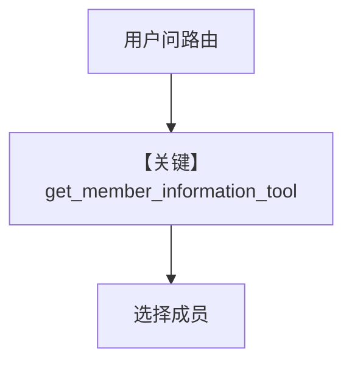

# member_information.py — 实现原理分析

<!-- cookbook-py-source:start -->
## 完整源码

```python
"""
Member Information
=================

Demonstrates enabling the `get_member_information_tool` capability on a Team.
"""

from agno.agent import Agent
from agno.models.openai import OpenAIResponses
from agno.team import Team

# ---------------------------------------------------------------------------
# Create Members
# ---------------------------------------------------------------------------
technical_agent = Agent(
    name="Technical Analyst",
    role="Technical investigations",
    model=OpenAIResponses(id="gpt-5-mini"),
    instructions=[
        "Handle technical implementation questions.",
        "Keep responses grounded and testable.",
    ],
)

billing_agent = Agent(
    name="Billing Specialist",
    role="Billing and invoicing",
    model=OpenAIResponses(id="gpt-5-mini"),
    instructions=[
        "Handle billing disputes and payment-related questions.",
        "Return clear next steps for account resolution.",
    ],
)


# ---------------------------------------------------------------------------
# Create Team
# ---------------------------------------------------------------------------
support_team = Team(
    name="Support Coordination Team",
    model=OpenAIResponses(id="gpt-5-mini"),
    members=[technical_agent, billing_agent],
    get_member_information_tool=True,
    instructions=[
        "Use team members as the source of truth for routing questions.",
        "Choose the most relevant member for each request.",
    ],
    show_members_responses=True,
)


# ---------------------------------------------------------------------------
# Run Team
# ---------------------------------------------------------------------------
if __name__ == "__main__":
    support_team.print_response(
        "I have a payment chargeback and also a bug in the mobile app. Which member is relevant for this?",
        stream=True,
    )
```

<!-- cookbook-py-source:end -->

> 源文件：`cookbook/03_teams/03_tools/member_information.py`

## 概述

**get_member_information_tool=True**（`agno/team/team.py` L222）：为队长注入查询成员元数据能力，辅助路由；`Team.get_member_information` 委托 `_tools.get_member_information`（L1402–1403）。

**核心配置一览：**

| 配置项 | 值 |
|--------|-----|
| `get_member_information_tool` | `True` |

## Mermaid 流程图


```mermaid
flowchart TD
    Q["用户问路由"] --> G["【关键】get_member_information_tool"]
    G --> R["选择成员"]
```

- **【关键】get_member_information_tool**：显式成员信息查询。

## 关键源码文件索引

| 文件 | 作用 |
|------|------|
| `agno/team/team.py` | L222, L1402 |
| `agno/team/_tools.py` | `get_member_information` |
