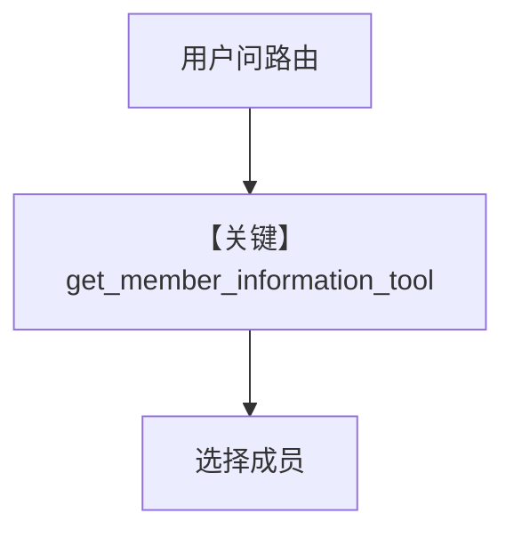

# member_information.py — 实现原理分析

> 源文件：`cookbook/03_teams/03_tools/member_information.py`

## 概述

**get_member_information_tool=True**（`agno/team/team.py` L222）：为队长注入查询成员元数据能力，辅助路由；`Team.get_member_information` 委托 `_tools.get_member_information`（L1402–1403）。

**核心配置一览：**

| 配置项 | 值 |
|--------|-----|
| `get_member_information_tool` | `True` |

## Mermaid 流程图

```mermaid
flowchart TD
    Q["用户问路由"] --> G["【关键】get_member_information_tool"]
    G --> R["选择成员"]
```

- **【关键】get_member_information_tool**：显式成员信息查询。

## 关键源码文件索引

| 文件 | 作用 |
|------|------|
| `agno/team/team.py` | L222, L1402 |
| `agno/team/_tools.py` | `get_member_information` |
