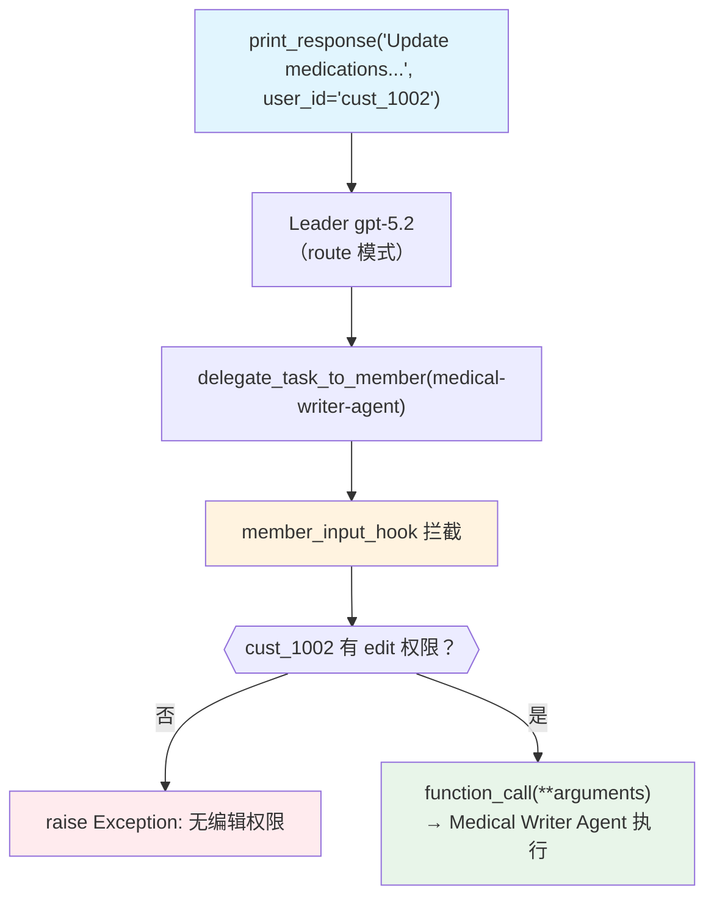

# member_tool_hooks.py — 实现原理分析

> 源文件：`cookbook/03_teams/03_tools/member_tool_hooks.py`

## 概述

本示例展示 Agno Team 的 **权限感知工具 Hook**：在 `member_input_hook` 中拦截 `delegate_task_to_member` 工具调用，根据 `session_state` 中的用户 ID 查询权限表，阻止无权限用户访问写操作成员（Medical Writer Agent）。这是 RBAC（基于角色的访问控制）在 Agent 层的实现模式。

**核心配置一览：**

| 配置项 | 值 | 说明 |
|--------|------|------|
| `name` | `"Company Info Team"` | Team 名称 |
| `model` | `OpenAIResponses(id="gpt-5.2")` | Leader |
| `mode` | `TeamMode.route` | 路由模式 |
| `tool_hooks` | `[member_input_hook]` | Leader 级工具 Hook |
| `members` | `[medical_reader_agent, medical_writer_agent]` | 读/写分离成员 |

## 核心组件解析

### Tool Hook 签名

```python
def member_input_hook(
    function_name: str,
    function_call: Callable,
    arguments: dict[str, Any],
    run_context: RunContext,
):
```

`tool_hooks` 在 Leader 调用工具**之前**执行。`run_context.session_state` 携带了运行时状态（此例为 `current_user_id`）。

### 权限检查逻辑

```python
if function_name == "delegate_task_to_member":
    member_id = arguments.get("member_id")
    customer_id = run_context.session_state.get("current_user_id")
    
    if member_id == "medical-writer-agent" and "edit" not in CUSTOMER_PERMISSIONS[customer_id]:
        raise Exception("Customer does not have edit permissions")
```

- `cust_1001` 有 `["view", "edit"]`：可读可写
- `cust_1002` 仅有 `["view"]`：读成功，写时抛出异常

### Hook 执行时序

```
Leader 决定委托成员 → tool_hook 拦截 → 权限检查
   ↓（通过）                              ↓（失败）
function_call(**arguments)            raise Exception → Leader 收到错误，向用户解释权限不足
```

## Mermaid 流程图



## 关键源码文件索引

| 文件 | 关键函数/类 | 作用 |
|------|------------|------|
| `agno/team/team.py` | `tool_hooks` | Leader 工具 Hook 列表 |
| `agno/run/context.py` | `RunContext.session_state` | 运行时会话状态 |
