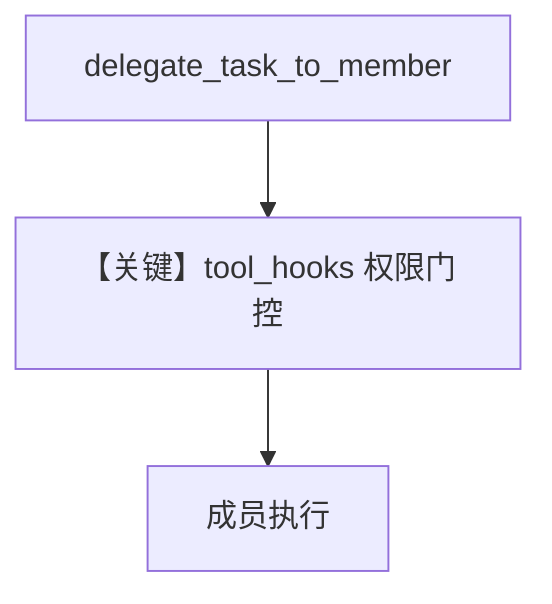

# member_tool_hooks.py — 实现原理分析

> 源文件：`cookbook/03_teams/03_tools/member_tool_hooks.py`

## 概述

**Team.tool_hooks**：在 **delegate_task_to_member** 等调用前后拦截；`member_input_hook` 根据 `session_state.current_user_id` 与 `CUSTOMER_PERMISSIONS` 校验 **view/edit**，再执行原函数。`mode=TeamMode.route`。

**核心配置一览：**

| 配置项 | 值 |
|--------|-----|
| `tool_hooks` | `[member_input_hook]` |
| `mode` | `TeamMode.route` |

## Mermaid 流程图

```mermaid
flowchart TD
    D["delegate_task_to_member"] --> H["【关键】tool_hooks 权限门控"]
    H --> M["成员执行"]
```

- **【关键】tool_hooks 权限门控**：委托前鉴权。

## 关键源码文件索引

| 文件 | 作用 |
|------|------|
| `agno/team/team.py` | `tool_hooks` 字段 |
