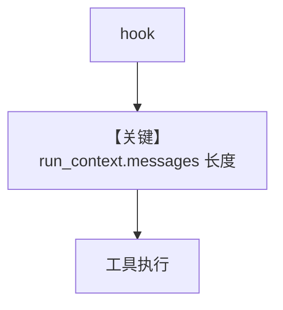

# message_history_in_tool_hooks.py — 实现原理分析

<!-- cookbook-py-source:start -->
## 完整源码

```python
"""
Message History In Tool Hooks
=============================

Access the current run's message history inside tool hooks in a team
via run_context.messages.
"""

from typing import Any, Callable, Dict

from agno.agent import Agent
from agno.models.openai import OpenAIChat
from agno.run.base import RunContext
from agno.team import Team
from agno.tools import FunctionCall, tool

# ---------------------------------------------------------------------------
# Create Members
# ---------------------------------------------------------------------------


def context_aware_hook(
    run_context: RunContext,
    function_name: str,
    function_call: Callable,
    arguments: Dict[str, Any],
):
    """Log conversation context before executing a member's tool."""
    msgs = run_context.messages
    count = len(msgs) if msgs else 0
    print(f"[hook] {function_name} - {count} messages in run")
    return function_call(**arguments)


def pre_hook(run_context: RunContext, fc: FunctionCall):
    msgs = run_context.messages
    count = len(msgs) if msgs else 0
    print(f"[pre-hook] {fc.function.name} - {count} messages in run")


@tool(pre_hook=pre_hook)
def get_weather(city: str) -> str:
    """Get the current weather for a city."""
    return f"Sunny, 72F in {city}"


weather_agent = Agent(
    name="Weather Agent",
    role="Get weather information for cities",
    model=OpenAIChat(id="gpt-4o-mini"),
    tools=[get_weather],
    tool_hooks=[context_aware_hook],
    instructions=["Use the tools to help the user."],
)

# ---------------------------------------------------------------------------
# Create Team
# ---------------------------------------------------------------------------
team = Team(
    name="Travel Team",
    model=OpenAIChat(id="gpt-4o-mini"),
    members=[weather_agent],
    mode="coordinate",
)

# ---------------------------------------------------------------------------
# Run Team
# ---------------------------------------------------------------------------
if __name__ == "__main__":
    team.print_response("What is the weather in Tokyo?")
```

<!-- cookbook-py-source:end -->

> 源文件：`cookbook/03_teams/03_tools/message_history_in_tool_hooks.py`

## 概述

**run_context.messages** 在 **tool_hooks** 与 **`@tool(pre_hook=...)`** 中可见：`context_aware_hook` 打印当前 run 消息条数；成员 `OpenAIChat` + `get_weather`；`Team(..., mode="coordinate")` 字符串形式（与 `TeamMode.coordinate` 等价，依框架解析）。

**核心配置一览：**

| 配置项 | 值 |
|--------|-----|
| `model` | `OpenAIChat`（Chat Completions） |
| `tool_hooks` | Agent 级 |

## Mermaid 流程图



- **【关键】run_context.messages**：钩子内读历史。

## 关键源码文件索引

| 文件 | 作用 |
|------|------|
| `agno/run/base.py` | `RunContext.messages` |
