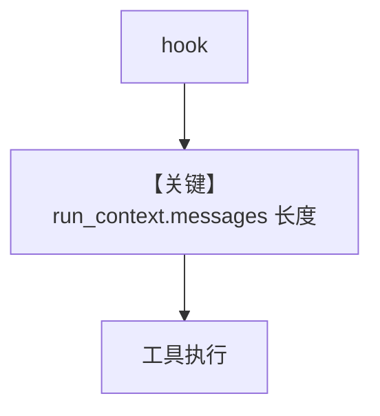

# message_history_in_tool_hooks.py — 实现原理分析

> 源文件：`cookbook/03_teams/03_tools/message_history_in_tool_hooks.py`

## 概述

**run_context.messages** 在 **tool_hooks** 与 **`@tool(pre_hook=...)`** 中可见：`context_aware_hook` 打印当前 run 消息条数；成员 `OpenAIChat` + `get_weather`；`Team(..., mode="coordinate")` 字符串形式（与 `TeamMode.coordinate` 等价，依框架解析）。

**核心配置一览：**

| 配置项 | 值 |
|--------|-----|
| `model` | `OpenAIChat`（Chat Completions） |
| `tool_hooks` | Agent 级 |

## Mermaid 流程图

- **【关键】run_context.messages**：钩子内读历史。

## 关键源码文件索引

| 文件 | 作用 |
|------|------|
| `agno/run/base.py` | `RunContext.messages` |
