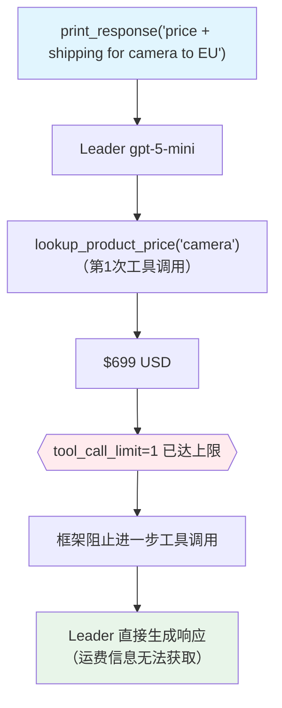

# tool_call_limit.py — 实现原理分析

> 源文件：`cookbook/03_teams/03_tools/tool_call_limit.py`

## 概述

本示例展示 Agno Team 的 **`tool_call_limit` 工具调用次数限制**：Orders Team 配置 `tool_call_limit=1`，即 Leader 在单次运行中最多只能调用一次工具。当用户同时需要价格和运费信息时，Leader 只能选择调用其中一个工具，体现了资源约束下的决策取舍。

**核心配置一览：**

| 配置项 | 值 | 说明 |
|--------|------|------|
| `name` | `"Order Team"` | Team 名称 |
| `model` | `OpenAIResponses(id="gpt-5-mini")` | Leader |
| `tools` | `[lookup_product_price, lookup_shipping_time]` | 两个查询工具 |
| `tool_call_limit` | `1` | 单次运行最多 1 次工具调用 |
| `members` | `[order_agent]` | Order Planner 成员 |

## 核心组件解析

### `tool_call_limit` 的约束机制

`tool_call_limit` 设置 Leader 在一次 `run()` 中可以调用的工具总次数上限（包括委托成员的 `delegate_task_to_member` 调用和自身工具调用）。达到上限后，即使模型想继续调用工具，框架也会阻止并要求模型直接生成文本响应。

### 使用场景

- **成本控制**：限制 LLM API 调用次数，控制每次运行的费用
- **响应速度**：避免过多工具调用导致延迟
- **测试与调试**：验证 Agent 在资源受限下的降级行为

### 约束下的行为

```
用户: "告诉我相机的价格和运往欧盟的运费"
Leader 第1次调用: lookup_product_price('camera') → "$699 USD"
→ 已达 tool_call_limit=1，无法再调用 lookup_shipping_time
Leader 响应: "相机价格为 $699 USD。抱歉，此次运行无法同时查询运费信息..."
```

## Mermaid 流程图



## 关键源码文件索引

| 文件 | 关键函数/类 | 作用 |
|------|------------|------|
| `agno/team/team.py` | `tool_call_limit` | 工具调用次数限制 |
| `agno/tools/__init__.py` | `@tool()` | 函数工具装饰器 |
