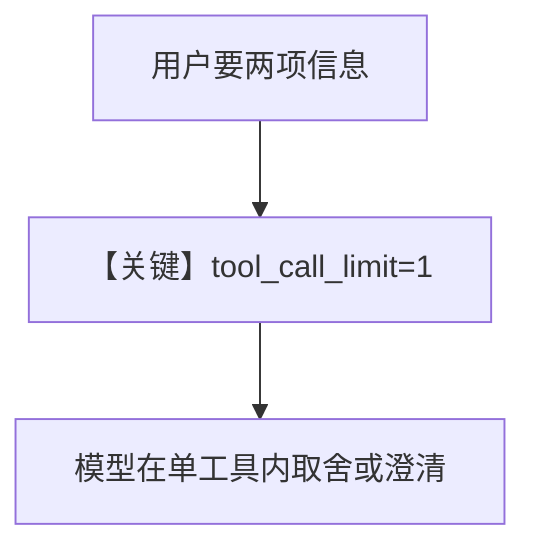

# tool_call_limit.py — 实现原理分析

<!-- cookbook-py-source:start -->
## 完整源码

```python
"""
Tool Call Limit
===============

Demonstrates constraining how many tool calls a Team can make in a single run.
"""

from agno.agent import Agent
from agno.models.openai import OpenAIResponses
from agno.team import Team
from agno.tools import tool


@tool()
def lookup_product_price(product_name: str) -> str:
    """Get a static price for supported products."""
    catalog = {
        "camera": "$699 USD",
        "drone": "$899 USD",
        "laptop": "$1,249 USD",
    }
    return catalog.get(product_name.lower(), "This product is not in the catalog")


@tool()
def lookup_shipping_time(country: str) -> str:
    """Get a static shipping time by destination."""
    shipping_times = {
        "us": "3-5 business days",
        "eu": "5-7 business days",
        "asia": "7-14 business days",
    }
    return shipping_times.get(country.lower(), "Unknown shipping zone")


# ---------------------------------------------------------------------------
# Create Members
# ---------------------------------------------------------------------------
order_agent = Agent(
    name="Order Planner",
    model=OpenAIResponses(id="gpt-5-mini"),
    instructions=[
        "Create accurate order summaries for the requested products.",
        "If info is missing, ask for clarification.",
    ],
)

# ---------------------------------------------------------------------------
# Create Team
# ---------------------------------------------------------------------------
orders_team = Team(
    name="Order Team",
    model=OpenAIResponses(id="gpt-5-mini"),
    members=[order_agent],
    tools=[lookup_product_price, lookup_shipping_time],
    tool_call_limit=1,
    instructions=[
        "You are a retail assistant.",
        "Use tools only when needed and keep responses concise.",
        "Remember that only one tool call is allowed in this run.",
    ],
    markdown=True,
)


# ---------------------------------------------------------------------------
# Run Team
# ---------------------------------------------------------------------------
if __name__ == "__main__":
    orders_team.print_response(
        "For the camera sale, tell me the price and shipping time to EU.",
        stream=True,
    )
```

<!-- cookbook-py-source:end -->

> 源文件：`cookbook/03_teams/03_tools/tool_call_limit.py`

## 概述

**tool_call_limit=1**（`team.py` L252）：单次 Team run 最多 **一次** 工具调用；示例需同时查价与物流，但强制只能调一个工具，演示 **预算型** 工具使用。

**核心配置一览：**

| 配置项 | 值 |
|--------|-----|
| `tool_call_limit` | `1` |
| `tools` | 两 lookup 函数 |

## Mermaid 流程图


```mermaid
flowchart TD
    R["用户要两项信息"] --> L["【关键】tool_call_limit=1"]
    L --> O["模型在单工具内取舍或澄清"]
```

- **【关键】tool_call_limit=1**：硬限制工具次数。

## 关键源码文件索引

| 文件 | 作用 |
|------|------|
| `agno/team/team.py` | L252 |
