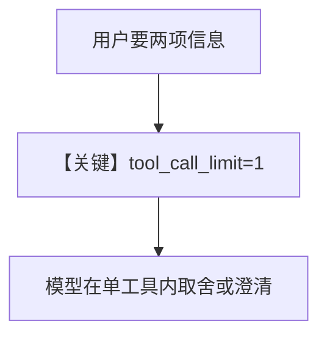

# tool_call_limit.py — 实现原理分析

> 源文件：`cookbook/03_teams/03_tools/tool_call_limit.py`

## 概述

**tool_call_limit=1**（`team.py` L252）：单次 Team run 最多 **一次** 工具调用；示例需同时查价与物流，但强制只能调一个工具，演示 **预算型** 工具使用。

**核心配置一览：**

| 配置项 | 值 |
|--------|-----|
| `tool_call_limit` | `1` |
| `tools` | 两 lookup 函数 |

## Mermaid 流程图

```mermaid
flowchart TD
    R["用户要两项信息"] --> L["【关键】tool_call_limit=1"]
    L --> O["模型在单工具内取舍或澄清"]
```

- **【关键】tool_call_limit=1**：硬限制工具次数。

## 关键源码文件索引

| 文件 | 作用 |
|------|------|
| `agno/team/team.py` | L252 |
