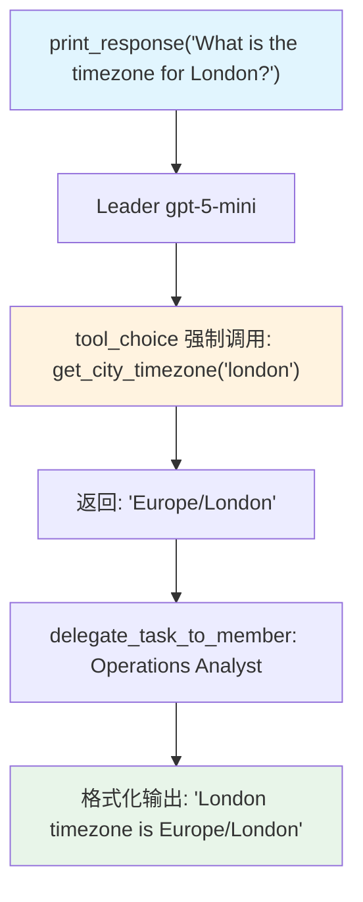

# tool_choice.py — 实现原理分析

> 源文件：`cookbook/03_teams/03_tools/tool_choice.py`

## 概述

本示例展示 Agno Team 的 **`tool_choice` 强制调用**：Leader 持有 `get_city_timezone` 工具，并通过 `tool_choice` 字段强制模型在每次响应时必须调用该工具，而不是依赖自身知识作答。成员 Operations Analyst 仅负责格式化工具输出。

**核心配置一览：**

| 配置项 | 值 | 说明 |
|--------|------|------|
| `name` | `"Tool Choice Team"` | Team 名称 |
| `model` | `OpenAIResponses(id="gpt-5-mini")` | Leader |
| `tools` | `[get_city_timezone]` | Leader 级工具 |
| `tool_choice` | `{"type": "function", "function": {"name": "get_city_timezone"}}` | 强制调用指定工具 |
| `members` | `[agent]` | Operations Analyst |

## 核心组件解析

### `tool_choice` 的工作机制

`tool_choice` 直接映射到 OpenAI API 的 `tool_choice` 参数。设置为具体函数名时，模型**必须**调用该函数，不能选择直接回答或调用其他工具。

```python
tool_choice={
    "type": "function",
    "function": {"name": "get_city_timezone"},
}
```

| 值 | 行为 |
|----|------|
| `"auto"` | 模型自主决定是否调用工具 |
| `"required"` | 必须调用某个工具（但哪个不限） |
| `{"type": "function", ...}` | 必须调用指定函数 |

### Leader 工具 vs 成员工具

本例中工具挂载在 **Leader** 上（`Team.tools`），而非成员：
- Leader 调用 `get_city_timezone` 获取数据
- Leader 将结果传递给 Operations Analyst 进行格式化响应

## Mermaid 流程图



## 关键源码文件索引

| 文件 | 关键函数/类 | 作用 |
|------|------------|------|
| `agno/team/team.py` | `tool_choice` | 工具调用策略配置 |
| `agno/tools/__init__.py` | `@tool()` | 函数工具装饰器 |
