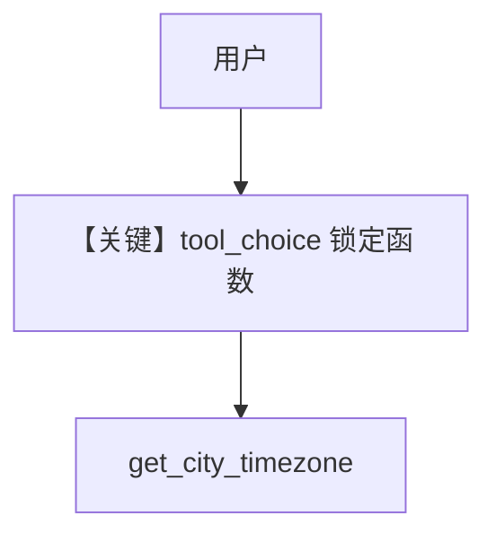

# tool_choice.py — 实现原理分析

> 源文件：`cookbook/03_teams/03_tools/tool_choice.py`

## 概述

**tool_choice** 强制下一请求走指定函数（OpenAI 风格 `{"type":"function","function":{"name":...}}`），见 `team.py` L250；确保时区查询 **必须** 调用 `get_city_timezone`。

**核心配置一览：**

| 配置项 | 值 |
|--------|-----|
| `tool_choice` | `{"type": "function", "function": {"name": "get_city_timezone"}}` |

## Mermaid 流程图

```mermaid
flowchart TD
    U["用户"] --> F["【关键】tool_choice 锁定函数"]
    F --> T["get_city_timezone"]
```

- **【关键】tool_choice 锁定函数**：提供商级强制工具。

## 关键源码文件索引

| 文件 | 作用 |
|------|------|
| `agno/team/team.py` | L250 |
