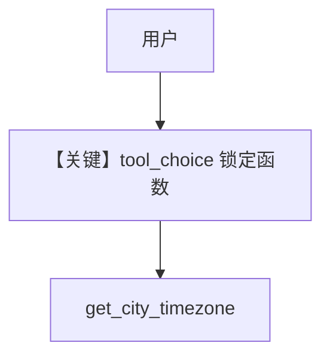

# tool_choice.py — 实现原理分析

<!-- cookbook-py-source:start -->
## 完整源码

```python
"""
Tool Choice
===========

Demonstrates using `tool_choice` to force the Team to execute a specific tool.
"""

from agno.agent import Agent
from agno.models.openai import OpenAIResponses
from agno.team import Team
from agno.tools import tool


@tool()
def get_city_timezone(city: str) -> str:
    """Return a known timezone identifier for a supported city."""
    city_to_timezone = {
        "new york": "America/New_York",
        "london": "Europe/London",
        "tokyo": "Asia/Tokyo",
        "sydney": "Australia/Sydney",
    }
    return city_to_timezone.get(city.lower(), "Unsupported city for this example")


# ---------------------------------------------------------------------------
# Create Members
# ---------------------------------------------------------------------------
agent = Agent(
    name="Operations Analyst",
    model=OpenAIResponses(id="gpt-5-mini"),
    instructions=[
        "Use the tool output to answer timezone questions.",
        "Do not invent values that are not in the tool output.",
    ],
)

# ---------------------------------------------------------------------------
# Create Team
# ---------------------------------------------------------------------------
teams_timezone = Team(
    name="Tool Choice Team",
    model=OpenAIResponses(id="gpt-5-mini"),
    members=[agent],
    tools=[get_city_timezone],
    tool_choice={
        "type": "function",
        "function": {"name": "get_city_timezone"},
    },
    instructions=[
        "You are a logistics assistant.",
        "For every request, resolve the city timezone using the available tool.",
        "Return the timezone identifier only in one sentence.",
    ],
    markdown=True,
)


# ---------------------------------------------------------------------------
# Run Team
# ---------------------------------------------------------------------------
if __name__ == "__main__":
    teams_timezone.print_response("What is the timezone for London?", stream=True)
```

<!-- cookbook-py-source:end -->

> 源文件：`cookbook/03_teams/03_tools/tool_choice.py`

## 概述

**tool_choice** 强制下一请求走指定函数（OpenAI 风格 `{"type":"function","function":{"name":...}}`），见 `team.py` L250；确保时区查询 **必须** 调用 `get_city_timezone`。

**核心配置一览：**

| 配置项 | 值 |
|--------|-----|
| `tool_choice` | `{"type": "function", "function": {"name": "get_city_timezone"}}` |

## Mermaid 流程图


```mermaid
flowchart TD
    U["用户"] --> F["【关键】tool_choice 锁定函数"]
    F --> T["get_city_timezone"]
```

- **【关键】tool_choice 锁定函数**：提供商级强制工具。

## 关键源码文件索引

| 文件 | 作用 |
|------|------|
| `agno/team/team.py` | L250 |
