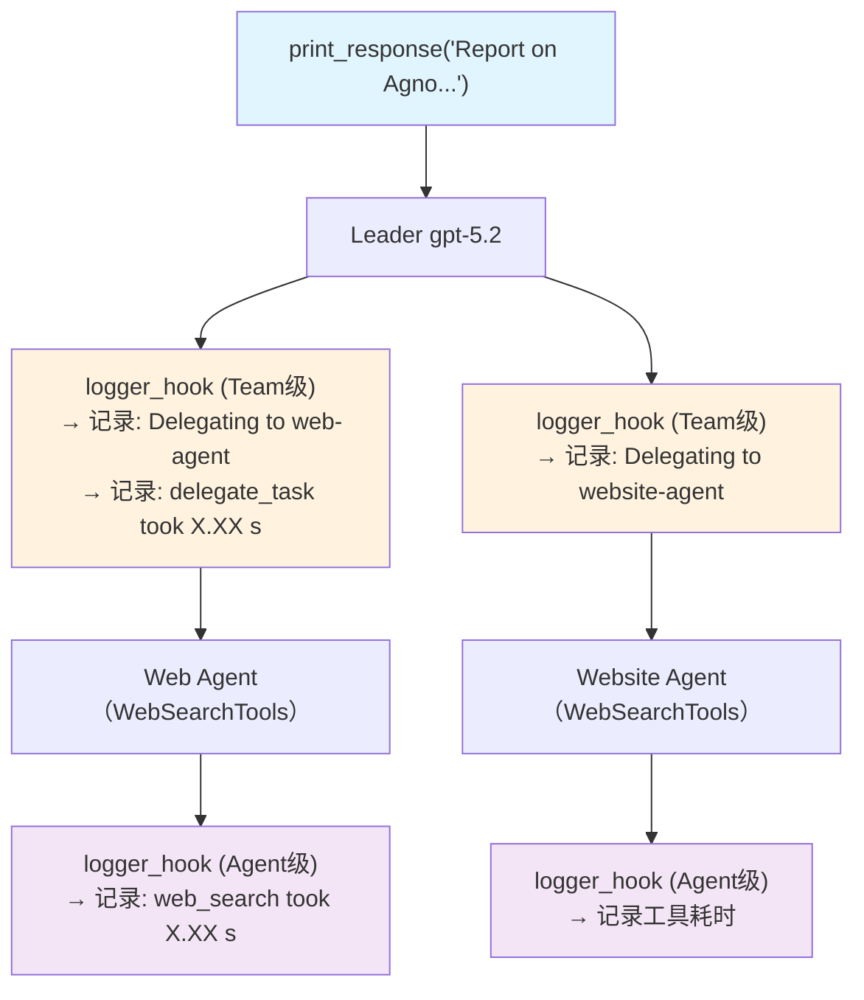

# tool_hooks.py — 实现原理分析

> 源文件：`cookbook/03_teams/03_tools/tool_hooks.py`

## 概述

本示例展示 Agno Team 的 **双层工具 Hook 日志**：`logger_hook` 同时注册在 Team Leader（`tool_hooks`）和每个成员 Agent（`tool_hooks`），实现委托日志（Leader 级）和工具执行耗时日志（成员级）的全链路监控。

**核心配置一览：**

| 配置项 | 值 | 说明 |
|--------|------|------|
| `name` | `"Company Info Team"` | Team 名称 |
| `model` | `OpenAIResponses(id="gpt-5.2")` | Leader |
| `tool_hooks` | `[logger_hook]` | Leader 级 Hook |
| `members` | `[web_agent, website_agent]`（各有 `tool_hooks`） | 两个搜索成员 |

## 核心组件解析

### Hook 函数结构

```python
def logger_hook(function_name: str, function_call: Callable, arguments: dict[str, Any]):
    if function_name == "delegate_task_to_member":
        logger.info(f"Delegating task to member {arguments.get('member_id')}")
    
    start_time = time.time()
    result = function_call(**arguments)  # 实际执行
    duration = time.time() - start_time
    logger.info(f"Function {function_name} took {duration:.2f} seconds")
    return result
```

Hook 是一个包裹函数（装饰器模式）：先执行前置逻辑，调用原始函数，再执行后置逻辑。

### 双层 Hook 的触发时机

| Hook 位置 | 触发条件 |
|-----------|---------|
| `Team.tool_hooks` | Leader 调用 `delegate_task_to_member` 时 |
| `Agent.tool_hooks` | 成员 Agent 调用其自身工具（如 `web_search`）时 |

两层独立触发，互不干扰，实现端到端可观测性。

## Mermaid 流程图



## 关键源码文件索引

| 文件 | 关键函数/类 | 作用 |
|------|------------|------|
| `agno/team/team.py` | `tool_hooks` | Team Leader 工具 Hook |
| `agno/agent/agent.py` | `tool_hooks` | 成员 Agent 工具 Hook |
