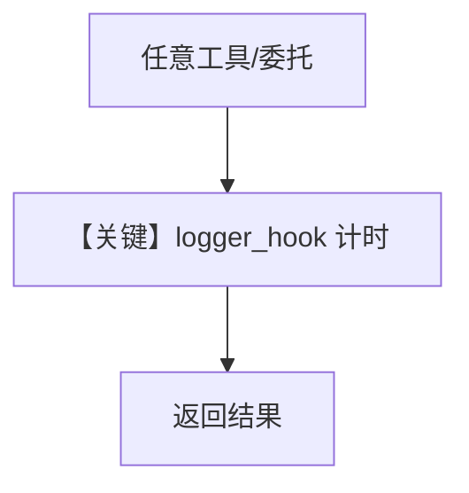

# tool_hooks.py — 实现原理分析

> 源文件：`cookbook/03_teams/03_tools/tool_hooks.py`

## 概述

**Team 与 Agent 共用 tool_hooks 模式**：`logger_hook` 对 `delegate_task_to_member` 打日志，并对所有工具调用计时；成员 `web_agent` 未显式 `model`（依赖默认），`website_agent` 使用 `OpenAIResponses`。

**核心配置一览：**

| 配置项 | 值 |
|--------|-----|
| `tool_hooks` | `[logger_hook]`（Team + 成员） |

## Mermaid 流程图

```mermaid
flowchart TD
    X["任意工具/委托"] --> L["【关键】logger_hook 计时"]
    L --> Y["返回结果"]
```

- **【关键】logger_hook 计时**：可观测性与委托日志。

## 关键源码文件索引

| 文件 | 作用 |
|------|------|
| `agno/team/team.py` | 工具钩子聚合 |
