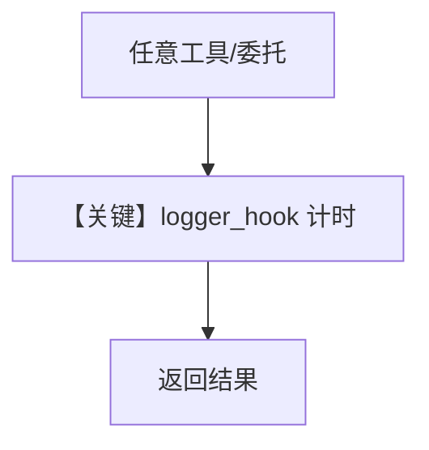

# tool_hooks.py — 实现原理分析

<!-- cookbook-py-source:start -->
## 完整源码

```python
"""
Tool Hooks
==========

Demonstrates team/member tool hooks for logging delegation and tool execution timing.
"""

import time
from typing import Any, Callable
from uuid import uuid4

from agno.agent import Agent
from agno.models.openai import OpenAIResponses
from agno.team import Team
from agno.tools.websearch import WebSearchTools
from agno.utils.log import logger


# ---------------------------------------------------------------------------
# Setup
# ---------------------------------------------------------------------------
def logger_hook(function_name: str, function_call: Callable, arguments: dict[str, Any]):
    """Log tool calls and execution time."""
    if function_name == "delegate_task_to_member":
        member_id = arguments.get("member_id")
        logger.info(f"Delegating task to member {member_id}")

    start_time = time.time()
    result = function_call(**arguments)
    end_time = time.time()
    duration = end_time - start_time
    logger.info(f"Function {function_name} took {duration:.2f} seconds to execute")
    return result


# ---------------------------------------------------------------------------
# Create Members
# ---------------------------------------------------------------------------
web_agent = Agent(
    name="Web Agent",
    id="reddit-agent",
    role="Search the web for information",
    tools=[WebSearchTools()],
    instructions=[
        "Find information about the company on the web",
    ],
    tool_hooks=[logger_hook],
)

website_agent = Agent(
    name="Website Agent",
    id="website-agent",
    role="Search the website for information",
    model=OpenAIResponses(id="gpt-5-mini"),
    tools=[WebSearchTools()],
    instructions=[
        "Search the website for information",
    ],
    tool_hooks=[logger_hook],
)

# ---------------------------------------------------------------------------
# Create Team
# ---------------------------------------------------------------------------
user_id = str(uuid4())

company_info_team = Team(
    name="Company Info Team",
    model=OpenAIResponses(id="gpt-5.2"),
    members=[web_agent, website_agent],
    markdown=True,
    instructions=[
        "You are a team that finds information about a company.",
        "First search the web and wikipedia for information about the company.",
        "If you can find the company's website URL, then scrape the homepage and the about page.",
    ],
    show_members_responses=True,
    tool_hooks=[logger_hook],
)

# ---------------------------------------------------------------------------
# Run Team
# ---------------------------------------------------------------------------
if __name__ == "__main__":
    company_info_team.print_response(
        "Write me a full report on everything you can find about Agno, the company building AI agent infrastructure.",
        stream=True,
    )
```

<!-- cookbook-py-source:end -->

> 源文件：`cookbook/03_teams/03_tools/tool_hooks.py`

## 概述

**Team 与 Agent 共用 tool_hooks 模式**：`logger_hook` 对 `delegate_task_to_member` 打日志，并对所有工具调用计时；成员 `web_agent` 未显式 `model`（依赖默认），`website_agent` 使用 `OpenAIResponses`。

**核心配置一览：**

| 配置项 | 值 |
|--------|-----|
| `tool_hooks` | `[logger_hook]`（Team + 成员） |

## Mermaid 流程图


```mermaid
flowchart TD
    X["任意工具/委托"] --> L["【关键】logger_hook 计时"]
    L --> Y["返回结果"]
```

- **【关键】logger_hook 计时**：可观测性与委托日志。

## 关键源码文件索引

| 文件 | 作用 |
|------|------|
| `agno/team/team.py` | 工具钩子聚合 |
