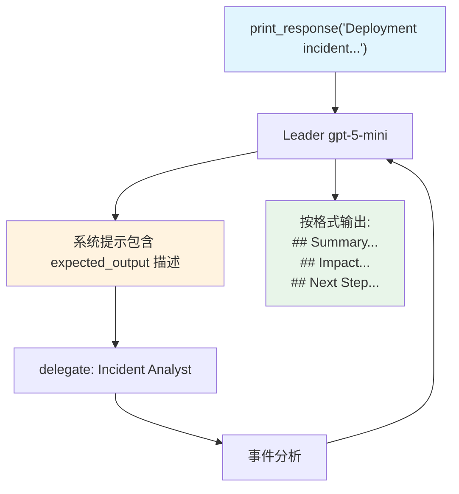

# expected_output.py — 实现原理分析

> 源文件：`cookbook/03_teams/04_structured_input_output/expected_output.py`

## 概述

本示例展示 Agno Team 的 **`expected_output` 自然语言格式约束**：与 `output_schema`（强类型）不同，`expected_output` 是用自然语言描述期望的输出格式，作为 instructions 的一部分注入 Leader 的系统提示，灵活但无类型验证。适合需要特定格式但不需要 Pydantic 类型约束的场景。

**核心配置一览：**

| 配置项 | 值 | 说明 |
|--------|------|------|
| `name` | `"Incident Reporting Team"` | Team 名称 |
| `model` | `OpenAIResponses(id="gpt-5-mini")` | Leader 和成员 |
| `expected_output` | `"Three sections: Summary, Impact, Next Step..."` | 自然语言格式描述 |
| `members` | `[incident_analyst]` | 事件分析师 |

## 核心组件解析

### `expected_output` vs `output_schema`

| 特性 | `expected_output` | `output_schema` |
|------|------------------|-----------------|
| 类型 | `str`（自然语言） | Pydantic / JSON Schema |
| 验证 | 无（模型遵从） | 强验证 |
| 注入方式 | 追加到系统提示 | 修改 API 参数 |
| 返回值类型 | `str` | Pydantic 实例 / dict |
| 适用场景 | 格式软约束 | 下游代码解析 |

### 系统提示中的呈现

`expected_output` 内容被追加到 Leader 系统提示的尾部，通常格式为：
```
Expected output: Three sections: Summary, Impact, and Next Step. Keep each section to one sentence.
```

## Mermaid 流程图



## 关键源码文件索引

| 文件 | 关键函数/类 | 作用 |
|------|------------|------|
| `agno/team/_messages.py` | `_build_trailing_sections()` | 将 expected_output 注入系统提示 |
| `agno/team/team.py` | `expected_output` | 期望输出描述字段 |
