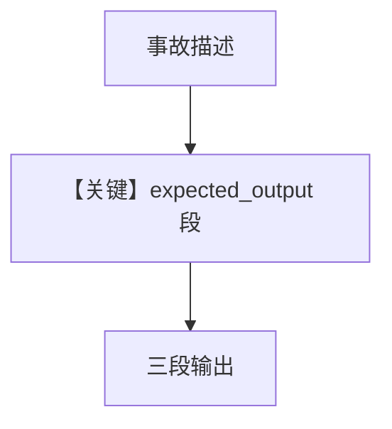

# expected_output.py — 实现原理分析

<!-- cookbook-py-source:start -->
## 完整源码

```python
"""
Expected Output
===============

Demonstrates setting a team-level `expected_output` to describe the desired
run result shape.
"""

from agno.agent import Agent
from agno.models.openai import OpenAIResponses
from agno.team import Team

# ---------------------------------------------------------------------------
# Create Members
# ---------------------------------------------------------------------------
incident_analyst = Agent(
    name="Incident Analyst",
    model=OpenAIResponses(id="gpt-5-mini"),
    instructions=[
        "Extract outcomes and risks clearly.",
        "Avoid unnecessary speculation.",
    ],
)


# ---------------------------------------------------------------------------
# Create Team
# ---------------------------------------------------------------------------
incident_team = Team(
    name="Incident Reporting Team",
    model=OpenAIResponses(id="gpt-5-mini"),
    members=[incident_analyst],
    expected_output=(
        "Three sections: Summary, Impact, and Next Step. "
        "Keep each section to one sentence."
    ),
    instructions=[
        "Summarize incidents in a clear operational style.",
        "Prefer plain language over technical jargon.",
    ],
)


# ---------------------------------------------------------------------------
# Run Team
# ---------------------------------------------------------------------------
if __name__ == "__main__":
    incident_team.print_response(
        (
            "A deployment changed the auth callback behavior, login requests increased by 12%, "
            "and a rollback script is already prepared."
        ),
        stream=True,
    )
```

<!-- cookbook-py-source:end -->

> 源文件：`cookbook/03_teams/04_structured_input_output/expected_output.py`

## 概述

**Team.expected_output**（`team.py` L153）：在 system 中注入 `<expected_output>` 段（与 Agent 一致，见 `team/_messages.py` 拼装链），约束最终回答为 **三段式** 一句摘要。

**核心配置一览：**

| 配置项 | 值 |
|--------|-----|
| `expected_output` | 三段落字面字符串 |
| `members` | 单 `incident_analyst` |

### 还原后的完整 System 文本（核心）

```text
Summarize incidents in a clear operational style.
Prefer plain language over technical jargon.

<expected_output>
Three sections: Summary, Impact, and Next Step. Keep each section to one sentence.
</expected_output>
```

（顺序以 `team/_messages.py` 中 description/instructions/expected_output 为准。）

## Mermaid 流程图


```mermaid
flowchart TD
    I["事故描述"] --> E["【关键】expected_output 段"]
    E --> O["三段输出"]
```

- **【关键】expected_output 段**：无 Pydantic 时的形状约束。

## 关键源码文件索引

| 文件 | 作用 |
|------|------|
| `agno/team/team.py` | L153 |
| `agno/team/_messages.py` | expected_output 拼装 |
