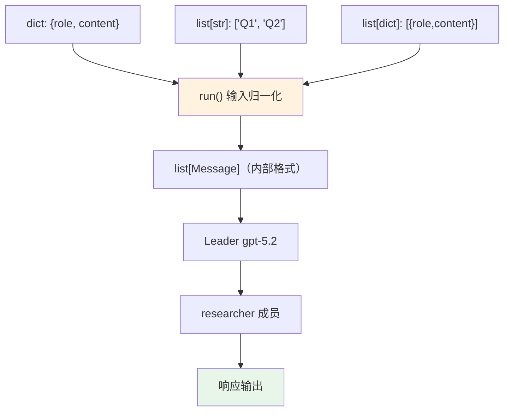

# input_formats.py — 实现原理分析

> 源文件：`cookbook/03_teams/04_structured_input_output/input_formats.py`

## 概述

本示例展示 Agno Team `print_response` / `run` 方法支持的**多种输入格式**：字符串、字典、字符串列表、消息字典列表。框架会自动将这些格式统一转换为内部消息结构，无需调用方手动转换。

**核心配置一览：**

| 配置项 | 值 | 说明 |
|--------|------|------|
| `name` | `"Research Team"` | Team 名称 |
| `model` | `OpenAIResponses(id="gpt-5.2")` | Leader 和成员同款 |
| `members` | `[researcher]` | 单名 Researcher |

## 核心组件解析

### 支持的输入格式

| 格式 | 示例 | 说明 |
|------|------|------|
| `str` | `"Explain AI"` | 最常用，纯文本 |
| `dict` | `{"role": "user", "content": "Explain AI"}` | 单条消息对象 |
| `list[str]` | `["What is ML?", "Keep it brief."]` | 多段文本拼接 |
| `list[dict]` | `[{"role": "user", "content": "..."}]` | 标准消息列表 |

### 转换机制

框架在 `run()` 入口处统一处理输入，将所有格式转换为 `list[Message]`，再传入 LLM。这允许调用者根据使用场景选择最方便的格式：

- **API 网关**：通常传入 `list[dict]`（直接映射 HTTP 请求体）
- **CLI 脚本**：直接传 `str`
- **批处理**：传入 `list[str]` 一次性提交多条指令

## Mermaid 流程图

## 关键源码文件索引

| 文件 | 关键函数/类 | 作用 |
|------|------------|------|
| `agno/team/team.py` | `run()` / `print_response()` | 输入格式处理入口 |
