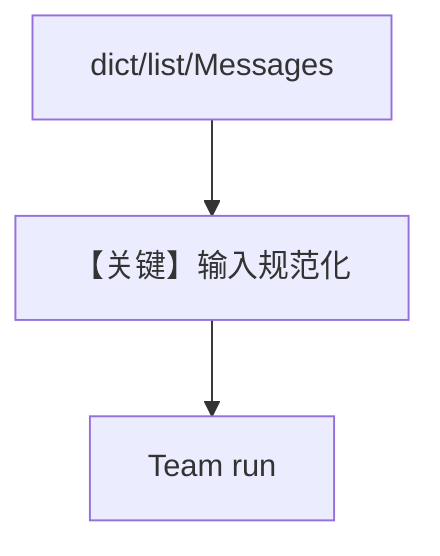

# input_formats.py — 实现原理分析

> 源文件：`cookbook/03_teams/04_structured_input_output/input_formats.py`

## 概述

**Team.print_response/run 输入形态**：`dict`（OpenAI 风格 message）、`list` 字符串拼接、`list[dict]` 多消息；框架将不同输入规范化后进入同一消息管线（见 `get_run_messages` 团队变体）。

**核心配置一览：**

| 配置项 | 值 |
|--------|-----|
| `members` | 单 Researcher |
| `model` | `OpenAIResponses` |

## Mermaid 流程图

```mermaid
flowchart TD
    D["dict/list/Messages"] --> N["【关键】输入规范化"]
    N --> R["Team run"]
```

- **【关键】输入规范化**：多形态 user 输入。

## 关键源码文件索引

| 文件 | 作用 |
|------|------|
| `agno/team/_messages.py` | `get_run_messages` / user 消息 |
