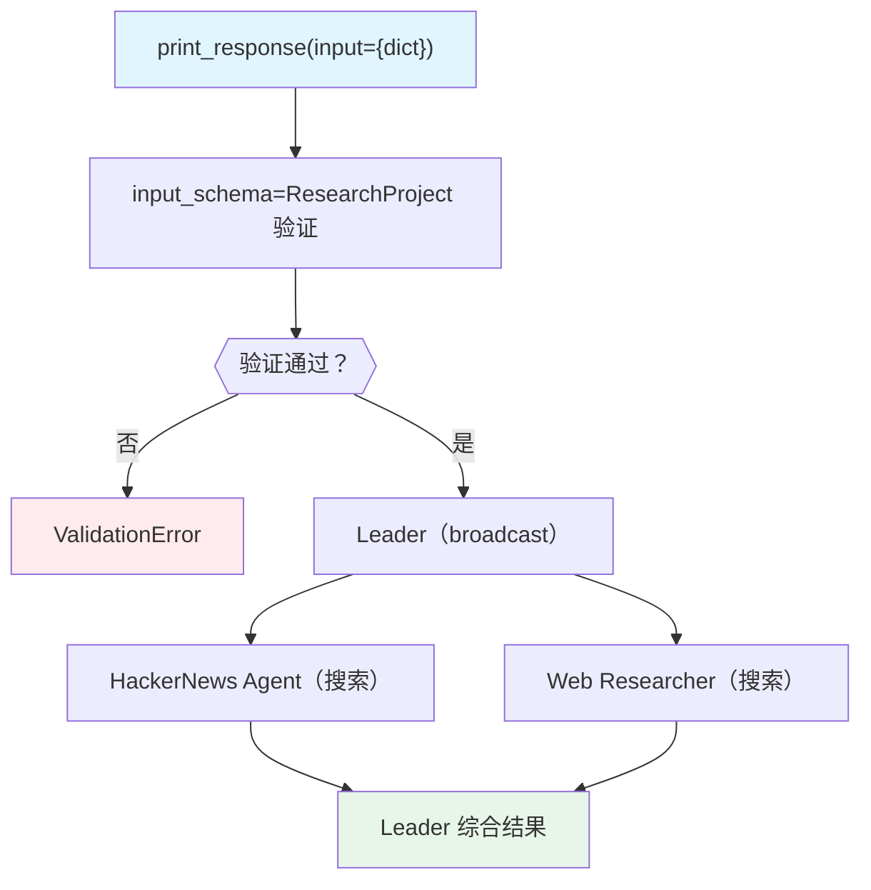

# input_schema.py — 实现原理分析

> 源文件：`cookbook/03_teams/04_structured_input_output/input_schema.py`

## 概述

本示例展示 Agno Team 的 **`input_schema` 自动输入验证**：Team 配置 `input_schema=ResearchProject`，当以字典形式传入输入时，框架自动将其验证并转换为 `ResearchProject` Pydantic 实例；直接传 Pydantic 实例则原样使用。这确保了 Team 在接收外部输入时的数据完整性和类型安全。

**核心配置一览：**

| 配置项 | 值 | 说明 |
|--------|------|------|
| `name` | `"Research Team with Input Validation"` | Team 名称 |
| `input_schema` | `ResearchProject` | 输入验证 schema |
| `mode` | `TeamMode.broadcast` | 广播模式（成员并发） |
| `members` | `[hackernews_agent, web_researcher]` | 两名搜索成员 |

## 核心组件解析

### `input_schema` 的工作流程

```python
# 字典输入 → 自动验证为 ResearchProject
research_team.print_response(
    input={
        "project_name": "AI Framework Comparison",
        "research_topics": ["LangChain", "Agno"],
        "depth_level": "intermediate",  # 必须匹配 ^(basic|intermediate|advanced)$
        "max_sources": 15,  # 必须在 3-20 范围内
    }
)
```

框架调用 `ResearchProject(**input_dict)` 进行验证，违反约束（如 `depth_level="expert"`）会在运行前抛出 `ValidationError`。

### 两种输入方式对比

| 方式 | 验证时机 | 优势 |
|------|---------|------|
| `dict` + `input_schema` | 框架自动验证 | 外部系统/API 传入的原始数据 |
| Pydantic 实例 | 创建时已验证 | 代码内部构造，类型安全 |

### broadcast 模式 + 结构化输入

broadcast 模式下，两名成员并发收到相同的结构化输入（序列化为 JSON），各自独立搜索 `research_topics` 中列出的主题。

## Mermaid 流程图



## 关键源码文件索引

| 文件 | 关键函数/类 | 作用 |
|------|------------|------|
| `agno/team/team.py` | `input_schema` | 输入验证 schema 配置 |
