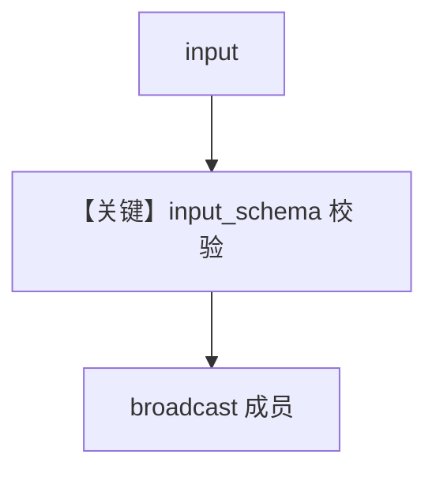

# input_schema.py — 实现原理分析

> 源文件：`cookbook/03_teams/04_structured_input_output/input_schema.py`

## 概述

**Team.input_schema=Pydantic**（`team.py` L266）：对用户 `input` 做校验；示例传 **dict** 与 **ResearchProject 实例**；`TeamMode.broadcast` 双研究员。

**核心配置一览：**

| 配置项 | 值 |
|--------|-----|
| `input_schema` | `ResearchProject` |
| `mode` | `TeamMode.broadcast` |

## 运行机制与因果链

非法字段在进模型前由 Pydantic 拒绝；合法输入再进入 broadcast 研究流程。

## Mermaid 流程图

```mermaid
flowchart TD
    U["input"] --> V["【关键】input_schema 校验"]
    V --> B["broadcast 成员"]
```

- **【关键】input_schema 校验**：结构化入参。

## 关键源码文件索引

| 文件 | 作用 |
|------|------|
| `agno/team/team.py` | L266 |
