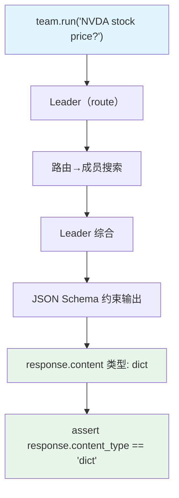

# json_schema_output.py — 实现原理分析

> 源文件：`cookbook/03_teams/04_structured_input_output/json_schema_output.py`

## 概述

本示例展示 Agno Team 的 **原生 JSON Schema 结构化输出**：不使用 Pydantic，而是直接将 OpenAI `json_schema` 格式的字典作为 `output_schema`，结合 `use_json_mode=True`，返回 `dict` 类型的结构化响应。适合与非 Python 系统集成或 schema 动态生成场景。

**核心配置一览：**

| 配置项 | 值 | 说明 |
|--------|------|------|
| `output_schema` | `stock_schema`（原生 JSON Schema 字典） | Team 级 schema |
| `use_json_mode` | `True` | 启用 JSON 模式 |
| `mode` | `TeamMode.route` | 路由模式 |
| `members` | `[stock_searcher, company_info_agent]` | 两名搜索成员 |

## 核心组件解析

### JSON Schema 格式

```python
stock_schema = {
    "type": "json_schema",
    "json_schema": {
        "name": "StockAnalysis",
        "schema": {
            "type": "object",
            "properties": {
                "symbol": {"type": "string"},
                "company_name": {"type": "string"},
                "analysis": {"type": "string"},
            },
            "required": ["symbol", "company_name", "analysis"],
            "additionalProperties": False,
        },
    },
}
```

此格式直接映射 OpenAI API 的 `response_format` 参数，框架不做 Pydantic 转换，`response.content` 为 `dict`。

### Pydantic vs JSON Schema 对比

| 特性 | Pydantic | JSON Schema |
|------|---------|-------------|
| 类型验证 | Python 类型系统 | JSON 规范验证 |
| 返回类型 | Pydantic 模型实例 | `dict` |
| 跨语言兼容 | 否 | 是 |
| Schema 动态生成 | 较复杂 | 直接拼接字符串/字典 |

## Mermaid 流程图



## 关键源码文件索引

| 文件 | 关键函数/类 | 作用 |
|------|------------|------|
| `agno/team/team.py` | `output_schema`, `use_json_mode` | JSON Schema 输出配置 |
