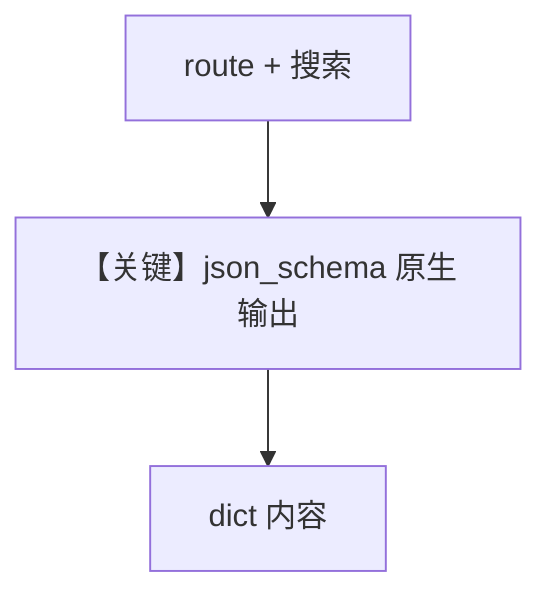

# json_schema_output.py — 实现原理分析

<!-- cookbook-py-source:start -->
## 完整源码

```python
"""
JSON Schema Output
==================

Demonstrates provider-native JSON schema output for team responses.
"""

from agno.agent import Agent
from agno.models.openai import OpenAIResponses
from agno.team import Team, TeamMode
from agno.tools.websearch import WebSearchTools
from agno.utils.pprint import pprint_run_response

# ---------------------------------------------------------------------------
# Setup
# ---------------------------------------------------------------------------
stock_schema = {
    "type": "json_schema",
    "json_schema": {
        "name": "StockAnalysis",
        "schema": {
            "type": "object",
            "properties": {
                "symbol": {"type": "string", "description": "Stock ticker symbol"},
                "company_name": {"type": "string", "description": "Company name"},
                "analysis": {"type": "string", "description": "Brief analysis"},
            },
            "required": ["symbol", "company_name", "analysis"],
            "additionalProperties": False,
        },
    },
}

# ---------------------------------------------------------------------------
# Create Members
# ---------------------------------------------------------------------------
stock_searcher = Agent(
    name="Stock Searcher",
    model=OpenAIResponses(id="gpt-5.2"),
    role="Searches for information on stocks and provides price analysis.",
    tools=[WebSearchTools()],
)

company_info_agent = Agent(
    name="Company Info Searcher",
    model=OpenAIResponses(id="gpt-5.2"),
    role="Searches for information about companies and recent news.",
    tools=[WebSearchTools()],
)

# ---------------------------------------------------------------------------
# Create Team
# ---------------------------------------------------------------------------
team = Team(
    name="Stock Research Team",
    model=OpenAIResponses(id="gpt-5.2"),
    mode=TeamMode.route,
    members=[stock_searcher, company_info_agent],
    output_schema=stock_schema,
    use_json_mode=True,
    markdown=True,
)

# ---------------------------------------------------------------------------
# Run Team
# ---------------------------------------------------------------------------
if __name__ == "__main__":
    response = team.run("What is the current stock price of NVDA?")
    assert isinstance(response.content, dict)
    assert response.content_type == "dict"
    pprint_run_response(response)
```

<!-- cookbook-py-source:end -->

> 源文件：`cookbook/03_teams/04_structured_input_output/json_schema_output.py`

## 概述

**output_schema** 传 **OpenAI json_schema 格式** dict + **`use_json_mode=True`**：`TeamMode.route` 双成员；`response.content` 为 **dict**，`content_type` 为 dict。

**核心配置一览：**

| 配置项 | 值 |
|--------|-----|
| `output_schema` | `stock_schema`（含 `type: json_schema`） |
| `use_json_mode` | `True` |

## Mermaid 流程图


```mermaid
flowchart TD
    R["route + 搜索"] --> J["【关键】json_schema 原生输出"]
    J --> D["dict 内容"]
```

- **【关键】json_schema 原生输出**：提供商 schema 模式。

## 关键源码文件索引

| 文件 | 作用 |
|------|------|
| `agno/models/openai/responses.py` | structured JSON |
