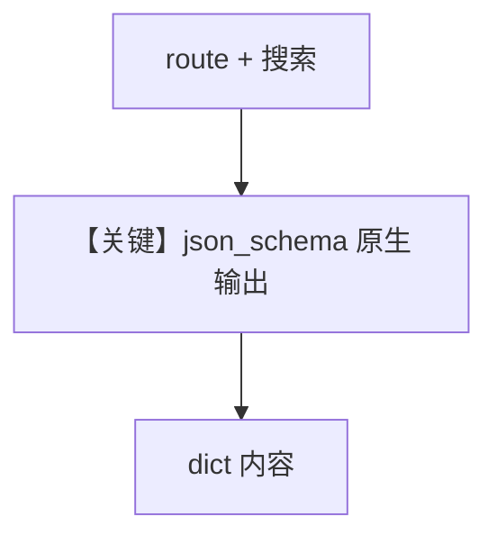

# json_schema_output.py — 实现原理分析

> 源文件：`cookbook/03_teams/04_structured_input_output/json_schema_output.py`

## 概述

**output_schema** 传 **OpenAI json_schema 格式** dict + **`use_json_mode=True`**：`TeamMode.route` 双成员；`response.content` 为 **dict**，`content_type` 为 dict。

**核心配置一览：**

| 配置项 | 值 |
|--------|-----|
| `output_schema` | `stock_schema`（含 `type: json_schema`） |
| `use_json_mode` | `True` |

## Mermaid 流程图

```mermaid
flowchart TD
    R["route + 搜索"] --> J["【关键】json_schema 原生输出"]
    J --> D["dict 内容"]
```

- **【关键】json_schema 原生输出**：提供商 schema 模式。

## 关键源码文件索引

| 文件 | 作用 |
|------|------|
| `agno/models/openai/responses.py` | structured JSON |
