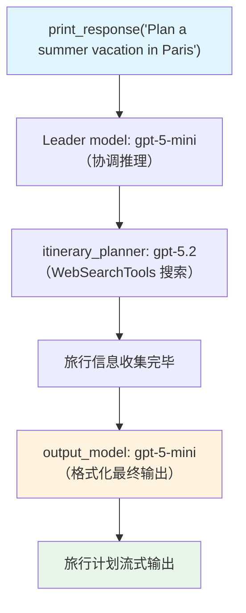

# output_model.py — 实现原理分析

> 源文件：`cookbook/03_teams/04_structured_input_output/output_model.py`

## 概述

本示例展示 Agno Team 的 **`output_model` 独立输出模型**：与 `model`（Leader 推理模型）不同，`output_model` 是专门用于**最终响应生成阶段**的模型。Leader 使用主模型完成推理和成员协调，最后用 `output_model` 生成用户可见的最终输出。适合"重量级推理模型+轻量级输出模型"的成本优化模式。

**核心配置一览：**

| 配置项 | 值 | 说明 |
|--------|------|------|
| `model` | `OpenAIResponses(id="gpt-5-mini")` | Leader 推理模型（协调） |
| `output_model` | `OpenAIResponses(id="gpt-5-mini")` | 输出生成模型（可选择不同） |
| `members` | `[itinerary_planner]`（gpt-5.2） | 重量级成员模型 |

## 核心组件解析

### `model` vs `output_model` 的分工

```
请求 → Leader（model: gpt-5-mini）→ 分析、协调、委托
                                    ↓
              成员（gpt-5.2）→ 高质量内容生成
                                    ↓
         Leader（output_model: gpt-5-mini）→ 最终格式化输出
```

- **`model`**：用于 Leader 的思考和决策，不直接面向用户
- **`output_model`**：用于最终生成用户可见响应，可单独选择更适合文本生成的模型

### 使用场景

当 Leader 推理需要多模态或特殊能力（如代码），但最终输出需要优化语言表达时，可以配置不同的 `output_model`（如专注文本生成的模型）。

## Mermaid 流程图



## 关键源码文件索引

| 文件 | 关键函数/类 | 作用 |
|------|------------|------|
| `agno/team/team.py` | `output_model` | 独立输出模型配置 |
