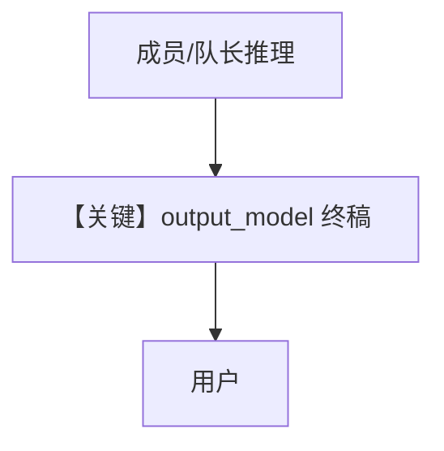

# output_model.py — 实现原理分析

> 源文件：`cookbook/03_teams/04_structured_input_output/output_model.py`

## 概述

**output_model**（`team.py` L275）：与队长 `model` 区分，用于 **生成最终对用户可见答复** 的独立模型实例；成员 `itinerary_planner` 仍用各自 `model` 做规划。

**核心配置一览：**

| 配置项 | 值 |
|--------|-----|
| `model` | `OpenAIResponses(gpt-5-mini)` |
| `output_model` | `OpenAIResponses(gpt-5-mini)` |

## Mermaid 流程图

```mermaid
flowchart TD
    M["成员/队长推理"] --> O["【关键】output_model 终稿"]
    O --> U["用户"]
```

- **【关键】output_model 终稿**：双阶段模型分工。

## 关键源码文件索引

| 文件 | 作用 |
|------|------|
| `agno/team/team.py` | L275-277 |
