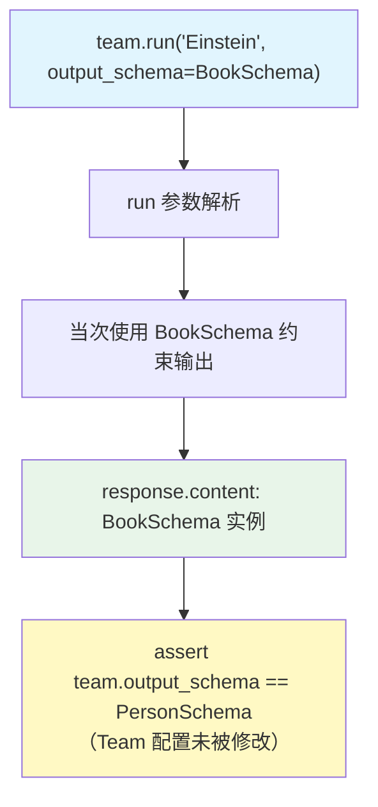

# output_schema_override.py — 实现原理分析

> 源文件：`cookbook/03_teams/04_structured_input_output/output_schema_override.py`

## 概述

本示例展示 Agno Team 的 **per-run `output_schema` 动态覆盖**：Team 默认 `output_schema=PersonSchema`，但每次 `run()` 调用可以通过 `output_schema=BookSchema` 参数临时覆盖，**不改变 Team 本身的配置**。覆盖作用域仅限当次 run，结束后 Team 的 `output_schema` 恢复为 `PersonSchema`。支持同步、异步、流式三种模式。

**核心配置一览：**

| 配置项 | 值 | 说明 |
|--------|------|------|
| `team.output_schema` | `PersonSchema` | Team 默认 schema |
| `run(output_schema=BookSchema)` | `BookSchema` | 当次覆盖 |
| `parser_team.parser_model` | `OpenAIResponses(id="gpt-5.2")` | 解析辅助模型 |
| `json_team.use_json_mode` | `True` | JSON 模式变体 |

## 核心组件解析

### 覆盖语义

```python
# 默认 schema: PersonSchema
response = team.run("Tell me about Albert Einstein")
assert isinstance(response.content, PersonSchema)

# per-run 覆盖: BookSchema（不改变 team.output_schema）
book_response = team.run("Tell me about '1984'", output_schema=BookSchema)
assert isinstance(book_response.content, BookSchema)
assert team.output_schema == PersonSchema  # Team 配置未变
```

### 三种 Team 变体

| Team | parser_model | use_json_mode | 说明 |
|------|-------------|---------------|------|
| `team` | 无 | False | 原生结构化输出 |
| `parser_team` | gpt-5.2 | False | 解析模型辅助 |
| `json_team` | 无 | True | JSON 模式 |

三种变体均支持 per-run `output_schema` 覆盖，验证框架的覆盖机制在各模式下均可正常工作。

## Mermaid 流程图



## 关键源码文件索引

| 文件 | 关键函数/类 | 作用 |
|------|------------|------|
| `agno/team/team.py` | `run(output_schema=...)` | per-run 覆盖参数 |
| `agno/team/team.py` | `parser_model`, `use_json_mode` | 解析模式变体 |
