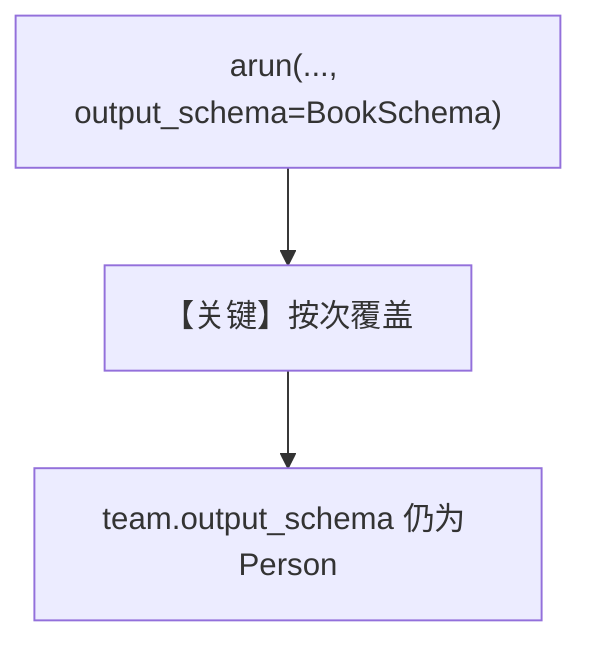

# output_schema_override.py — 实现原理分析

> 源文件：`cookbook/03_teams/04_structured_input_output/output_schema_override.py`

## 概述

**单次 run 覆盖 `output_schema`**：`run`/`arun` 传入 `output_schema=BookSchema`，跑完 **不修改** `team.output_schema` 属性（示例 assert）；覆盖 **sync/async** 与 **stream**；对比 **`parser_model`** 与 **`use_json_mode`** 两套 Team。

**核心配置一览：**

| 配置项 | 值 |
|--------|-----|
| 默认 `output_schema` | `PersonSchema` |
| 覆盖 | `BookSchema` |
| `parser_team` | `parser_model` |
| `json_team` | `use_json_mode=True` |

## Mermaid 流程图

```mermaid
flowchart TD
    R["arun(..., output_schema=BookSchema)"] --> K["【关键】按次覆盖"]
    K --> A["team.output_schema 仍为 Person"]
```

- **【关键】按次覆盖**：临时 schema 不改变 Team 配置对象。

## 关键源码文件索引

| 文件 | 作用 |
|------|------|
| `agno/team/team.py` | `run` 参数 `output_schema` |
