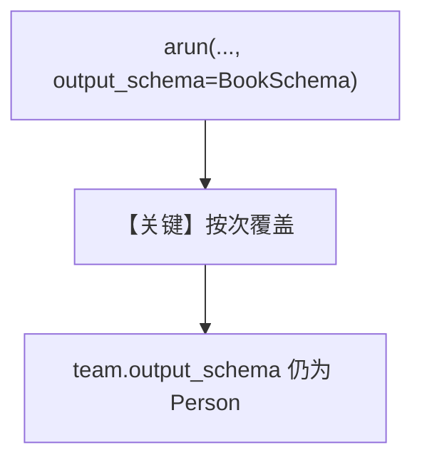

# output_schema_override.py — 实现原理分析

<!-- cookbook-py-source:start -->
## 完整源码

```python
"""
Output Schema Override
======================

Demonstrates per-run output_schema overrides across sync/async and streaming modes.
"""

import asyncio

from agno.agent import Agent
from agno.models.openai import OpenAIResponses
from agno.team import Team
from agno.tools.websearch import WebSearchTools
from pydantic import BaseModel
from rich.pretty import pprint


class PersonSchema(BaseModel):
    name: str
    age: int


class BookSchema(BaseModel):
    title: str
    author: str
    year: int


# ---------------------------------------------------------------------------
# Create Members
# ---------------------------------------------------------------------------
researcher = Agent(
    name="Researcher",
    model=OpenAIResponses(id="gpt-5.2"),
    role="Researches information.",
    tools=[WebSearchTools()],
)

# ---------------------------------------------------------------------------
# Create Team
# ---------------------------------------------------------------------------
team = Team(
    name="Research Team",
    model=OpenAIResponses(id="gpt-5.2"),
    members=[researcher],
    output_schema=PersonSchema,
    markdown=False,
)

parser_team = Team(
    name="Parser Team",
    model=OpenAIResponses(id="gpt-5.2"),
    parser_model=OpenAIResponses(id="gpt-5.2"),
    members=[researcher],
    output_schema=PersonSchema,
    markdown=False,
)

json_team = Team(
    name="JSON Team",
    model=OpenAIResponses(id="gpt-5.2"),
    members=[researcher],
    output_schema=PersonSchema,
    use_json_mode=True,
    markdown=False,
)


# ---------------------------------------------------------------------------
# Run Team
# ---------------------------------------------------------------------------
async def test_async_override() -> None:
    response = await team.arun("Tell me about Marie Curie", stream=False)
    assert isinstance(response.content, PersonSchema)
    pprint(response.content)

    print(f"\nSchema before override: {team.output_schema.__name__}")
    book_response = await team.arun(
        "Tell me about 'The Great Gatsby'",
        output_schema=BookSchema,
        stream=False,
    )
    assert isinstance(book_response.content, BookSchema)
    pprint(book_response.content)
    assert team.output_schema == PersonSchema
    print(f"Schema after override: {team.output_schema.__name__}")


async def test_async_streaming_override() -> None:
    print(f"\nSchema before override: {team.output_schema.__name__}")
    run_response = None
    async for event_or_response in team.arun(
        "Tell me about 'Pride and Prejudice'",
        output_schema=BookSchema,
        stream=True,
    ):
        run_response = event_or_response

    assert isinstance(run_response.content, BookSchema)
    pprint(run_response.content)
    assert team.output_schema == PersonSchema
    print(f"Schema after override: {team.output_schema.__name__}")


if __name__ == "__main__":
    response = team.run("Tell me about Albert Einstein", stream=False)
    assert isinstance(response.content, PersonSchema)
    pprint(response.content)

    print(f"\nSchema before override: {team.output_schema.__name__}")
    book_response = team.run(
        "Tell me about '1984' by George Orwell",
        output_schema=BookSchema,
        stream=False,
    )
    assert isinstance(book_response.content, BookSchema)
    pprint(book_response.content)
    print(f"Schema after override: {team.output_schema.__name__}")
    assert team.output_schema == PersonSchema

    print(f"\nSchema before override: {team.output_schema.__name__}")
    run_response = None
    for event_or_response in team.run(
        "Tell me about 'To Kill a Mockingbird'",
        output_schema=BookSchema,
        stream=True,
    ):
        run_response = event_or_response

    assert isinstance(run_response.content, BookSchema)
    pprint(run_response.content)
    assert team.output_schema == PersonSchema
    print(f"Schema after override: {team.output_schema.__name__}")

    print(f"\nSchema before override: {parser_team.output_schema.__name__}")
    parser_response = parser_team.run(
        "Research information about 'Moby Dick'",
        output_schema=BookSchema,
        stream=False,
    )
    assert isinstance(parser_response.content, BookSchema)
    pprint(parser_response.content)
    print(f"Schema after override: {parser_team.output_schema.__name__}")
    assert parser_team.output_schema == PersonSchema

    print(f"\nSchema before override: {json_team.output_schema.__name__}")
    json_response = json_team.run(
        "Research information about 'The Hobbit'",
        output_schema=BookSchema,
        stream=False,
    )
    assert isinstance(json_response.content, BookSchema)
    pprint(json_response.content)
    print(f"Schema after override: {json_team.output_schema.__name__}")
    assert json_team.output_schema == PersonSchema

    asyncio.run(test_async_override())
    asyncio.run(test_async_streaming_override())
```

<!-- cookbook-py-source:end -->

> 源文件：`cookbook/03_teams/04_structured_input_output/output_schema_override.py`

## 概述

**单次 run 覆盖 `output_schema`**：`run`/`arun` 传入 `output_schema=BookSchema`，跑完 **不修改** `team.output_schema` 属性（示例 assert）；覆盖 **sync/async** 与 **stream**；对比 **`parser_model`** 与 **`use_json_mode`** 两套 Team。

**核心配置一览：**

| 配置项 | 值 |
|--------|-----|
| 默认 `output_schema` | `PersonSchema` |
| 覆盖 | `BookSchema` |
| `parser_team` | `parser_model` |
| `json_team` | `use_json_mode=True` |

## Mermaid 流程图


```mermaid
flowchart TD
    R["arun(..., output_schema=BookSchema)"] --> K["【关键】按次覆盖"]
    K --> A["team.output_schema 仍为 Person"]
```

- **【关键】按次覆盖**：临时 schema 不改变 Team 配置对象。

## 关键源码文件索引

| 文件 | 作用 |
|------|------|
| `agno/team/team.py` | `run` 参数 `output_schema` |
