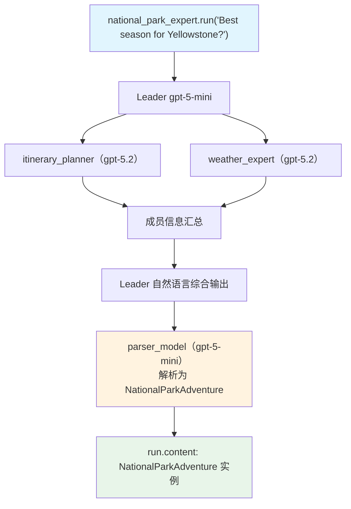

# parser_model.py — 实现原理分析

> 源文件：`cookbook/03_teams/04_structured_input_output/parser_model.py`

## 概述

本示例展示 Agno Team 的 **`parser_model` 解析辅助模型**：Team 使用 gpt-5-mini 作为 Leader，但配置 `parser_model=OpenAIResponses(id="gpt-5-mini")` 专门用于将 Leader 的自然语言输出解析为 `NationalParkAdventure` Pydantic 结构（含 11 个字段）。适合 Leader 模型不支持原生结构化输出或需要更可靠解析的场景。

**核心配置一览：**

| 配置项 | 值 | 说明 |
|--------|------|------|
| `model` | `OpenAIResponses(id="gpt-5-mini")` | Leader 推理模型 |
| `output_schema` | `NationalParkAdventure`（含11字段） | 复杂结构化输出 |
| `parser_model` | `OpenAIResponses(id="gpt-5-mini")` | 专用解析模型 |
| `members` | `[itinerary_planner(gpt-5.2), weather_expert(gpt-5.2)]` | 重量级成员 |

## 核心组件解析

### `parser_model` 的两阶段流程

```
阶段1: Leader（gpt-5-mini）→ 协调成员，生成自然语言综合响应
                              ↓
阶段2: parser_model（gpt-5-mini）→ 接收 Leader 输出，
       解析为 NationalParkAdventure（11个字段，含类型约束）
```

### 为何需要 `parser_model`？

当 `output_schema` 的字段较多、结构复杂（如本例11个字段含 `List[str]`、`int` 约束）时，直接让 Leader 在生成响应的同时遵守严格 JSON Schema 可能降低输出质量。`parser_model` 将推理和解析分离，各模型专注自己的任务。

### 复杂 Schema

```python
class NationalParkAdventure(BaseModel):
    park_name: str
    best_season: str
    signature_attractions: List[str]
    recommended_trails: List[str]
    wildlife_encounters: List[str]
    photography_spots: List[str]
    camping_options: List[str]
    safety_warnings: List[str]
    hidden_gems: List[str]
    difficulty_rating: int  # 1-5
    estimated_days: int  # 1-14
    special_permits_needed: List[str] = []
```

## Mermaid 流程图



## 关键源码文件索引

| 文件 | 关键函数/类 | 作用 |
|------|------------|------|
| `agno/team/team.py` | `parser_model` | 解析辅助模型配置 |
| `agno/run/response.py` | `RunOutput` | 运行输出封装 |
